# API Gateway: Class Diagram

This document provides a class diagram showing the core entities and their relationships in the API Gateway service.

## Class Diagram

```mermaid
classDiagram
    class Server {
        -router Router
        -grpcClient CoordinatorClient
        -httpServer HttpServer
        +NewServer(cfg, client) Server
        +SetupRoutes()
        +Start() error
        +Shutdown(ctx) error
    }
    
    class Handlers {
        -grpcClient CoordinatorClient
        -converter Converter
        -errorHandler ErrorHandler
        +WriteKeyValue(w, r)
        +ReadKeyValue(w, r)
        +CreateTenant(w, r)
        +UpdateReplicationFactor(w, r)
        +GetTenant(w, r)
        +AddStorageNode(w, r)
        +RemoveStorageNode(w, r)
        +GetMigrationStatus(w, r)
        +ListStorageNodes(w, r)
    }
    
    class CoordinatorClient {
        -client CoordinatorServiceClient
        -endpoints string[]
        -conn ClientConn
        +WriteKeyValue(ctx, req) WriteKeyValueResponse
        +ReadKeyValue(ctx, req) ReadKeyValueResponse
        +CreateTenant(ctx, req) CreateTenantResponse
        +UpdateReplicationFactor(ctx, req) UpdateReplicationFactorResponse
        +GetTenant(ctx, req) GetTenantResponse
        +AddStorageNode(ctx, req) AddStorageNodeResponse
        +RemoveStorageNode(ctx, req) RemoveStorageNodeResponse
        +GetMigrationStatus(ctx, req) GetMigrationStatusResponse
        +ListStorageNodes(ctx, req) ListStorageNodesResponse
        +HealthCheck() error
        +Close() error
    }
    
    class Converter {
        +WriteKeyValueRequest(r) WriteKeyValueRequest
        +ReadKeyValueRequest(r) ReadKeyValueRequest
        +CreateTenantRequest(r) CreateTenantRequest
        +UpdateReplicationFactorRequest(r) UpdateReplicationFactorRequest
        +GetTenantRequest(r) GetTenantRequest
        +AddStorageNodeRequest(r) AddStorageNodeRequest
        +RemoveStorageNodeRequest(r) RemoveStorageNodeRequest
        +GetMigrationStatusRequest(r) GetMigrationStatusRequest
        +ListStorageNodesRequest(r) ListStorageNodesRequest
        +WriteKeyValueResponse(resp) interface
        +ReadKeyValueResponse(resp) interface
        +CreateTenantResponse(resp) interface
        +UpdateReplicationFactorResponse(resp) interface
        +GetTenantResponse(resp) interface
        +AddStorageNodeResponse(resp) interface
        +RemoveStorageNodeResponse(resp) interface
        +GetMigrationStatusResponse(resp) interface
        +ListStorageNodesResponse(resp) interface
    }
    
    class ErrorHandler {
        -logger Logger
        +HandleError(w, err)
        +GrpcToHTTPStatus(err) int
        +WriteErrorResponse(w, statusCode, errorCode, message)
    }
    
    class Config {
        +Server ServerConfig
        +Coordinator CoordinatorConfig
        +RateLimiter RateLimiterConfig
        +Metrics MetricsConfig
        +Logging LoggingConfig
    }
    
    class ServerConfig {
        +Port int
        +ReadTimeout Duration
        +WriteTimeout Duration
        +IdleTimeout Duration
        +ShutdownTimeout Duration
    }
    
    class CoordinatorConfig {
        +Endpoints string[]
        +Timeout Duration
        +MaxRetries int
        +RetryBackoff Duration
        +KeepaliveTime Duration
        +KeepaliveTimeout Duration
        +MaxReceiveMessageSize int
        +MaxSendMessageSize int
    }
    
    class RateLimiterConfig {
        +Enabled bool
        +RequestsPerSecond int
        +BurstSize int
    }
    
    class MetricsConfig {
        +Enabled bool
        +Port int
        +Path string
    }
    
    class LoggingConfig {
        +Level string
        +Format string
        +Output string
    }
    
    class HealthHandler {
        +HealthHandler(w, r)
        +ReadinessHandler(client) HandlerFunc
    }
    
    class Middleware {
        +AuthMiddleware(next) HandlerFunc
        +RateLimitMiddleware(next) HandlerFunc
        +LoggingMiddleware(next) HandlerFunc
        +RequestIDMiddleware(next) HandlerFunc
    }
    
    Server --> Handlers : uses
    Handlers --> CoordinatorClient : uses
    Handlers --> Converter : uses
    Handlers --> ErrorHandler : uses
    Server --> Config : uses
    Config --> ServerConfig : contains
    Config --> CoordinatorConfig : contains
    Config --> RateLimiterConfig : contains
    Config --> MetricsConfig : contains
    Config --> LoggingConfig : contains
    Server --> HealthHandler : uses
    Server --> Middleware : uses
```

## Class Descriptions

### Server
- Main HTTP server that handles incoming requests
- Manages routing, middleware, and graceful shutdown
- Coordinates between handlers and gRPC client

### Handlers
- HTTP request handlers for all API endpoints
- Converts HTTP requests to gRPC, calls coordinator, and converts responses back
- Handles errors and writes HTTP responses

### CoordinatorClient
- gRPC client wrapper for communicating with Coordinator service
- Manages connection pooling and load balancing
- Provides methods for all coordinator operations

### Converter
- Converts between HTTP (JSON) and gRPC (protobuf) formats
- Handles request conversion (HTTP → gRPC)
- Handles response conversion (gRPC → HTTP)

### ErrorHandler
- Maps gRPC errors to HTTP status codes
- Formats error responses consistently
- Logs errors for debugging

### Config
- Configuration structure for the API Gateway
- Contains nested configuration for server, coordinator, rate limiter, metrics, and logging

### HealthHandler
- Provides health check endpoints (/health, /ready)
- Checks coordinator connectivity for readiness

### Middleware
- HTTP middleware for authentication, rate limiting, logging, and request ID propagation

