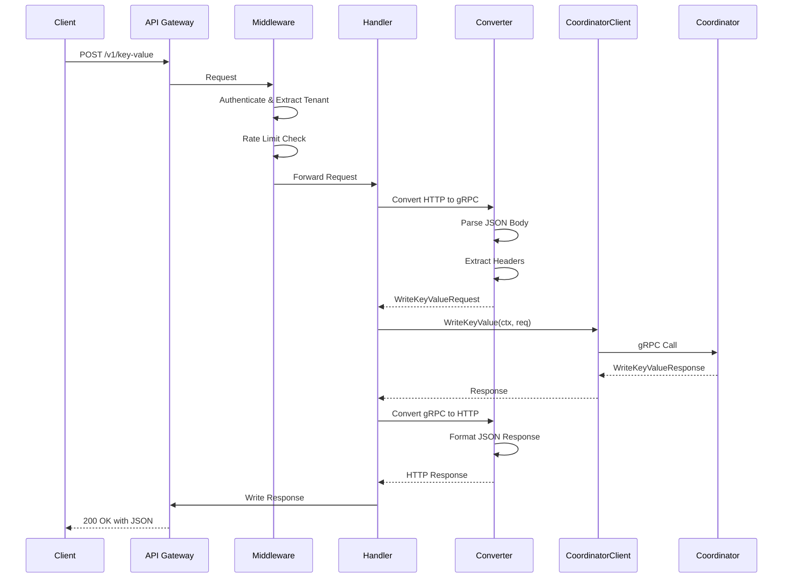
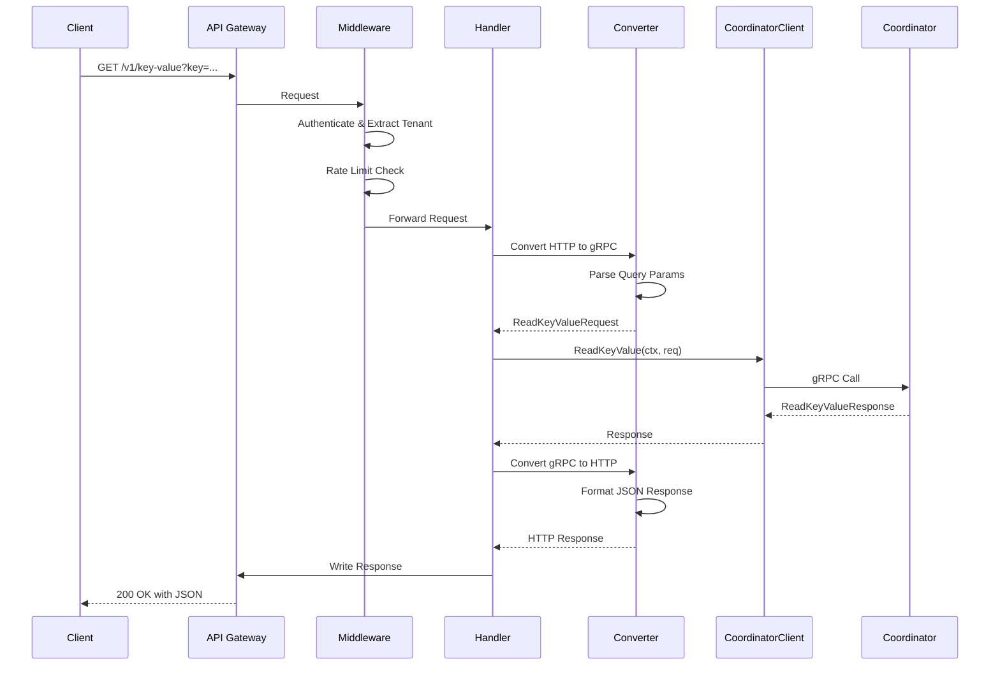
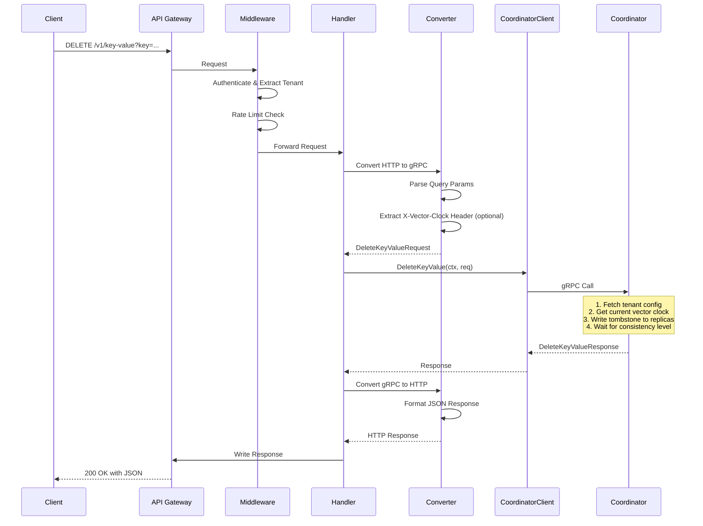
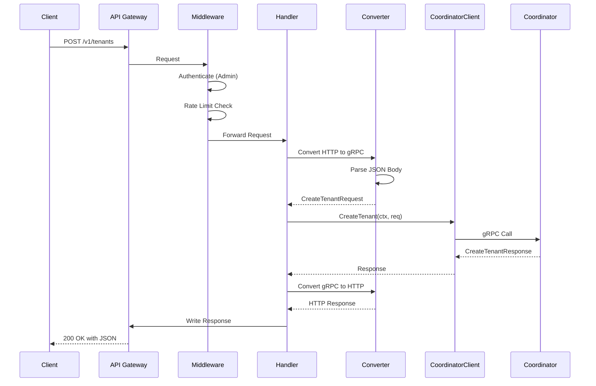
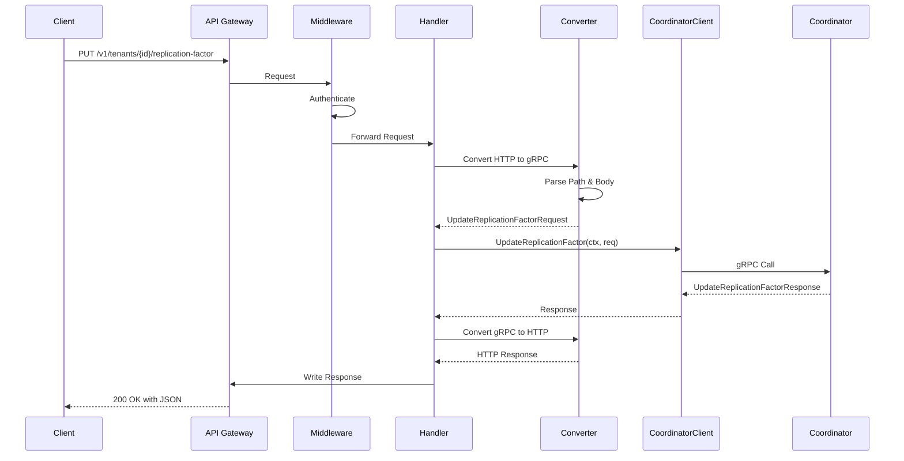
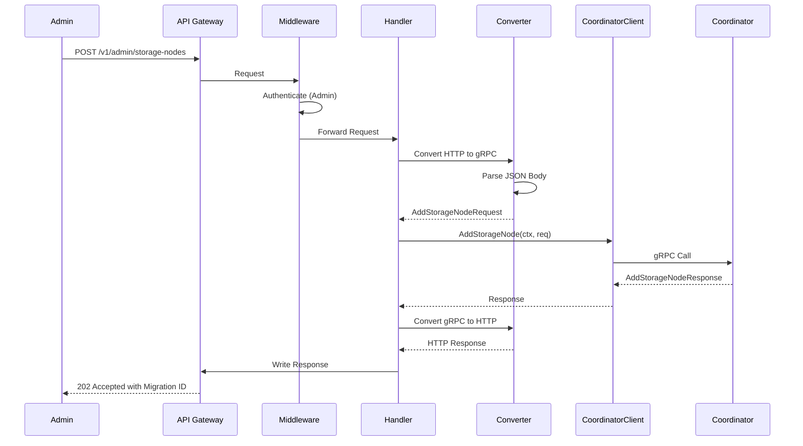
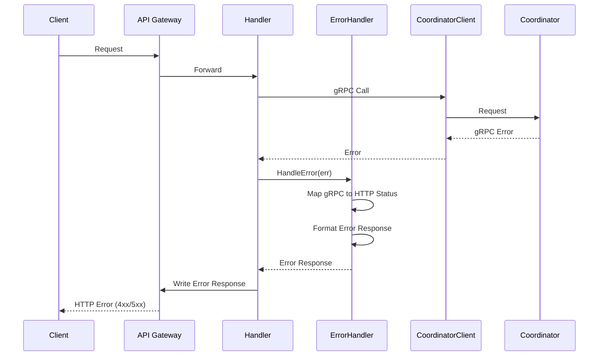
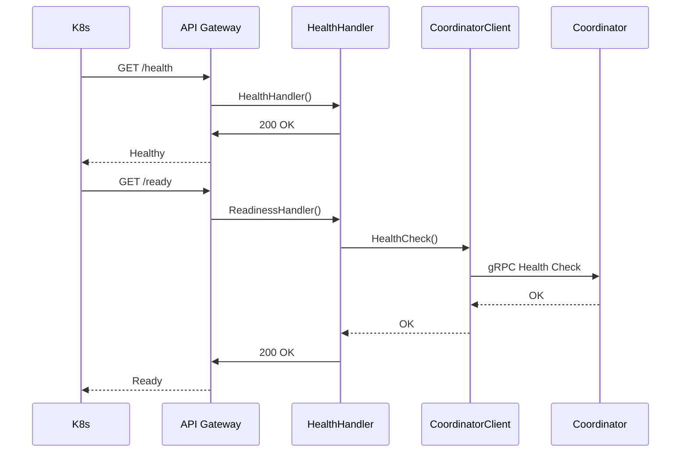
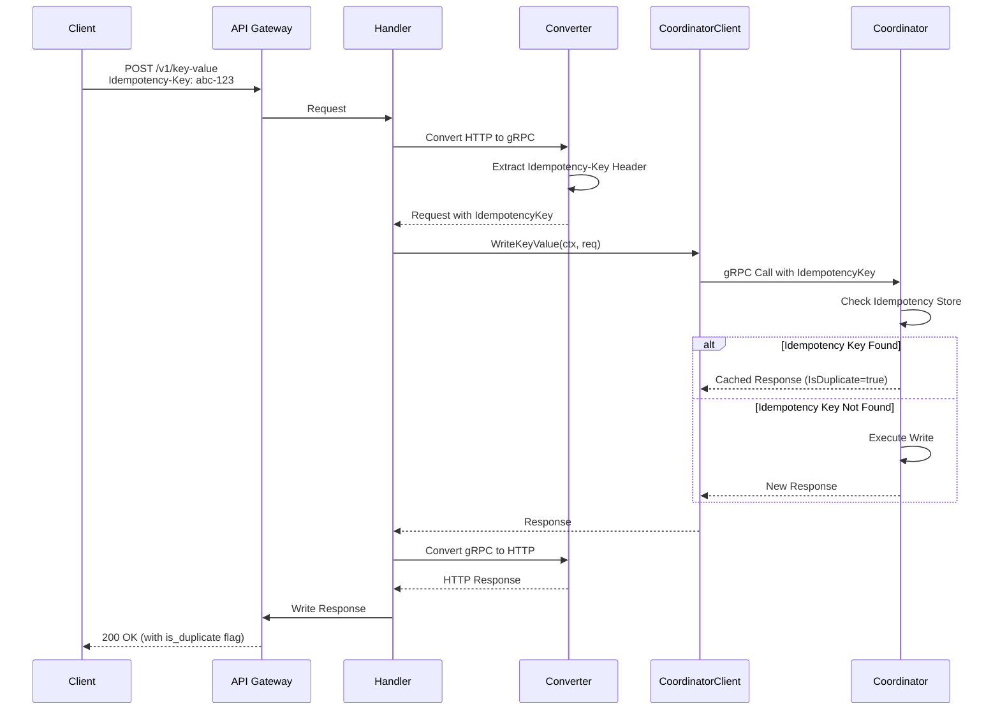

# API Gateway: Sequence Diagrams

This document provides sequence diagrams for all major flows supported by the API Gateway service.

## 1. Write Key-Value Flow

## 2. Read Key-Value Flow

## 3. Delete Key-Value Flow

## 4. Create Tenant Flow

## 4. Update Replication Factor Flow

## 5. Add Storage Node Flow

## 6. Error Handling Flow

## 7. Health Check Flow

## 8. Idempotency Key Handling Flow

## Flow Descriptions

### Write Key-Value Flow
1. Client sends HTTP POST request with JSON body
2. Middleware authenticates and extracts tenant ID
3. Rate limiter checks if request is within limits
4. Handler converts HTTP request to gRPC request
5. Coordinator client makes gRPC call to Coordinator
6. Response is converted back to HTTP JSON
7. Response sent to client

### Read Key-Value Flow
1. Client sends HTTP GET request with query parameters
2. Similar flow to write, but reads from coordinator
3. Returns key-value pair with vector clock

### Delete Key-Value Flow
1. Client sends HTTP DELETE request with query parameters
2. Middleware authenticates and extracts tenant ID
3. Handler extracts optional vector clock from X-Vector-Clock header
4. Coordinator fetches tenant configuration from metadata store
5. Coordinator reads current value to get latest vector clock (if not provided)
6. Coordinator increments vector clock for delete operation
7. Coordinator writes tombstone markers to replica nodes based on consistency level
8. Waits for acknowledgments per consistency level (one/quorum/all)
9. Returns success response with tombstone vector clock
10. Tombstones eventually removed during compaction

### Create Tenant Flow
1. Admin client creates new tenant
2. Requires admin authentication
3. Coordinator creates tenant in metadata store

### Update Replication Factor Flow
1. Updates tenant's replication factor
2. May trigger data migration
3. Returns updated tenant configuration

### Add Storage Node Flow
1. Admin adds new storage node
2. Coordinator initiates migration
3. Returns migration ID for tracking

### Error Handling Flow
1. Errors from coordinator are caught
2. Error handler maps gRPC errors to HTTP status codes
3. Consistent error response format returned

### Health Check Flow
1. Kubernetes probes health endpoint
2. Readiness check verifies coordinator connectivity
3. Returns appropriate status codes

### Idempotency Key Handling Flow
1. Client provides idempotency key in header
2. Coordinator checks idempotency store
3. Returns cached response if duplicate, otherwise processes request

