# Coordinator: Class Diagram

This document provides a class diagram showing the core entities and their relationships in the Coordinator service.

## Class Diagram

```mermaid
classDiagram
    class CoordinatorService {
        -tenantService: *TenantService
        -routingService: *RoutingService
        -consistencyService: *ConsistencyService
        -vectorClockService: *VectorClockService
        -idempotencyService: *IdempotencyService
        -conflictService: *ConflictService
        -storageClient: *StorageClient
        -logger: *zap.Logger
        -nodeID: string
        +WriteKeyValue(ctx, tenantID, key, value, consistency, idempotencyKey) *WriteResponse
        +ReadKeyValue(ctx, tenantID, key, consistency) *ReadResponse
        +writeToReplicas(ctx, replicas, tenantID, key, value, vectorClock, requiredReplicas) int, []*StorageResponse
        +readFromReplicas(ctx, replicas, tenantID, key, requiredReplicas) []*StorageResponse
    }
    
    class TenantService {
        -metadataStore: *MetadataStore
        -cache: *Cache
        -logger: *zap.Logger
        +GetTenant(ctx, tenantID) *Tenant
        +CreateTenant(ctx, tenantID, replicationFactor) *Tenant
        +UpdateReplicationFactor(ctx, tenantID, newReplicationFactor) *Tenant
    }
    
    class RoutingService {
        -hashRing: *HashRing
        -metadataStore: *MetadataStore
        -hasher: *ConsistentHasher
        -logger: *zap.Logger
        -mu: sync.RWMutex
        +GetReplicas(tenantID, key, replicationFactor) []*StorageNode
        +refreshHashRing()
        +updateHashRing(ctx) error
    }
    
    class ConsistencyService {
        -defaultLevel: string
        +GetRequiredReplicas(consistency, totalReplicas) int
        +ValidateConsistencyLevel(level) bool
    }
    
    class VectorClockService {
        -nodeID: string
        -localTimestamp: int64
        -mu: sync.Mutex
        +Increment(nodeID) VectorClock
        +Merge(clocks...) VectorClock
        +Compare(vc1, vc2) VectorClockComparison
    }
    
    class IdempotencyService {
        -store: *IdempotencyStore
        -ttl: time.Duration
        -logger: *zap.Logger
        +Generate(tenantID, key) string
        +Get(ctx, tenantID, key, idempotencyKey) *WriteResponse
        +Store(ctx, tenantID, key, idempotencyKey, response) error
    }
    
    class ConflictService {
        -vectorClockService: *VectorClockService
        -storageClient: *StorageClient
        -logger: *zap.Logger
        -repairQueue: chan *RepairRequest
        +DetectConflicts(responses) *StorageResponse, []*StorageResponse
        +TriggerRepair(ctx, tenantID, key, latest, replicas)
        +repairWorker()
        +executeRepair(ctx, req) error
    }
    
    class StorageClient {
        -connections: map[string]*grpc.ClientConn
        -mu: sync.RWMutex
        +Write(ctx, node, tenantID, key, value, vectorClock) *StorageResponse
        +Read(ctx, node, tenantID, key) *StorageResponse
        +getConnection(node) *grpc.ClientConn
        +Close()
    }
    
    class MetadataStore {
        -pool: *pgxpool.Pool
        +GetTenant(ctx, tenantID) *Tenant
        +CreateTenant(ctx, tenant) error
        +UpdateTenant(ctx, tenant) error
        +GetStorageNodes(ctx) []*StorageNode
        +Close()
    }
    
    class IdempotencyStore {
        -client: *redis.Client
        +Get(ctx, tenantID, key, idempotencyKey) []byte
        +Set(ctx, tenantID, key, idempotencyKey, data, ttl) error
        +Close() error
    }
    
    class Cache {
        -tenantCache: map[string]*cacheEntry
        -mu: sync.RWMutex
        -ttl: time.Duration
        +GetTenant(tenantID) *Tenant, bool
        +SetTenant(tenantID, tenant)
        +DeleteTenant(tenantID)
        +cleanup()
    }
    
    class ConsistentHasher {
        -ring: []uint64
        -ringMap: map[uint64]string
        -nodeVNodes: map[string][]uint64
        -mu: sync.RWMutex
        +AddNode(nodeID, virtualNodeCount)
        +RemoveNode(nodeID)
        +GetNodes(keyHash, count) []*VirtualNode
        +Hash(key) uint64
        +Clear()
    }
    
    class HashRing {
        -Nodes: map[string]*StorageNode
        -VirtualNodes: []*VirtualNode
        -LastUpdated: time.Time
    }
    
    class Tenant {
        +TenantID: string
        +ReplicationFactor: int
        +CreatedAt: time.Time
        +UpdatedAt: time.Time
        +Version: int64
    }
    
    class StorageNode {
        +NodeID: string
        +Host: string
        +Port: int
        +Status: NodeStatus
        +VirtualNodes: int
    }
    
    class VectorClock {
        +Entries: []VectorClockEntry
    }
    
    class VectorClockEntry {
        +CoordinatorNodeID: string
        +LogicalTimestamp: int64
    }
    
    class WriteResponse {
        +Success: bool
        +Key: string
        +IdempotencyKey: string
        +VectorClock: VectorClock
        +ReplicaCount: int
        +Consistency: string
        +IsDuplicate: bool
    }
    
    class ReadResponse {
        +Success: bool
        +Key: string
        +Value: []byte
        +VectorClock: VectorClock
    }
    
    class StorageResponse {
        +NodeID: string
        +Success: bool
        +Value: []byte
        +VectorClock: VectorClock
        +Error: error
    }
    
    CoordinatorService --> TenantService : uses
    CoordinatorService --> RoutingService : uses
    CoordinatorService --> ConsistencyService : uses
    CoordinatorService --> VectorClockService : uses
    CoordinatorService --> IdempotencyService : uses
    CoordinatorService --> ConflictService : uses
    CoordinatorService --> StorageClient : uses
    
    TenantService --> MetadataStore : uses
    TenantService --> Cache : uses
    
    RoutingService --> HashRing : uses
    RoutingService --> MetadataStore : uses
    RoutingService --> ConsistentHasher : uses
    
    ConflictService --> VectorClockService : uses
    ConflictService --> StorageClient : uses
    
    IdempotencyService --> IdempotencyStore : uses
    
    HashRing --> StorageNode : contains
    ConsistentHasher --> HashRing : manages
```

## Class Descriptions

### CoordinatorService
- Main service orchestrating all coordinator operations
- Coordinates write and read operations across storage nodes
- Manages consistency, idempotency, and conflict resolution

### TenantService
- Manages tenant configurations
- Uses cache for fast tenant lookups
- Handles tenant creation and replication factor updates

### RoutingService
- Manages consistent hash ring for data distribution
- Routes requests to appropriate storage node replicas
- Periodically refreshes hash ring from metadata store

### ConsistencyService
- Calculates required replica count based on consistency level
- Validates consistency level strings
- Supports one, quorum, and all consistency levels

### VectorClockService
- Manages vector clocks for causality tracking
- Increments local timestamp for writes
- Compares and merges vector clocks for conflict detection

### IdempotencyService
- Generates and manages idempotency keys
- Stores and retrieves cached responses from Redis
- Prevents duplicate writes

### ConflictService
- Detects conflicts using vector clock comparison
- Triggers repair operations for conflicting replicas
- Manages repair queue and workers

### StorageClient
- gRPC client for communicating with storage nodes
- Manages connection pooling per storage node
- Handles write and read operations

### MetadataStore
- PostgreSQL store for tenant and node metadata
- Provides ACID-compliant storage for configurations
- Handles optimistic locking for updates

### IdempotencyStore
- Redis store for idempotency keys
- Fast lookups with TTL support
- Distributed cache for duplicate detection

### Cache
- In-memory cache for tenant configurations
- TTL-based expiration
- Reduces database load

### ConsistentHasher
- Implements consistent hashing algorithm
- Manages virtual nodes for load distribution
- Provides node lookup for given key hash

### HashRing
- Represents the consistent hash ring topology
- Contains mapping of nodes and virtual nodes
- Updated periodically from metadata store

