# Coordinator: Class Diagram

This document provides a class diagram showing the core entities and their relationships in the Coordinator service.

## Class Diagram

```mermaid
classDiagram
    class CoordinatorService {
        -tenantService: *TenantService
        -routingService: *RoutingService
        -consistencyService: *ConsistencyService
        -vectorClockService: *VectorClockService
        -idempotencyService: *IdempotencyService
        -conflictService: *ConflictService
        -storageClient: *StorageClient
        -logger: *zap.Logger
        -nodeID: string
        +WriteKeyValue(ctx, tenantID, key, value, consistency, idempotencyKey) *WriteResponse
        +ReadKeyValue(ctx, tenantID, key, consistency) *ReadResponse
        +writeToReplicas(ctx, replicas, tenantID, key, value, vectorClock, requiredReplicas) int, []*StorageResponse
        +readFromReplicas(ctx, replicas, tenantID, key, requiredReplicas) []*StorageResponse
    }
    
    class TenantService {
        -metadataStore: *MetadataStore
        -cache: *Cache
        -logger: *zap.Logger
        +GetTenant(ctx, tenantID) *Tenant
        +CreateTenant(ctx, tenantID, replicationFactor) *Tenant
        +UpdateReplicationFactor(ctx, tenantID, newReplicationFactor) *Tenant
    }
    
    class RoutingService {
        -hashRing: *HashRing
        -metadataStore: *MetadataStore
        -hasher: *ConsistentHasher
        -logger: *zap.Logger
        -mu: sync.RWMutex
        +GetReplicas(tenantID, key, replicationFactor) []*StorageNode
        +GetWriteReplicas(ctx, tenantID, key, rf) []*StorageNode
        +GetReadReplicas(ctx, tenantID, key, rf) []*StorageNode
        +GetAuthoritativeReplicas(nodes) []*StorageNode
        +CountAuthoritativeReplicas(nodes) int
        +refreshHashRing()
        +updateHashRing(ctx) error
    }
    
    class ConsistencyService {
        -defaultLevel: string
        +GetRequiredReplicas(consistency, totalReplicas) int
        +GetRequiredReplicasForWriteSet(consistency, writeReplicas) int
        +ValidateConsistencyLevel(level) bool
    }
    
    class VectorClockService {
        -nodeID: string
        -localTimestamp: int64
        -mu: sync.Mutex
        +Increment(nodeID) VectorClock
        +Merge(clocks...) VectorClock
        +Compare(vc1, vc2) VectorClockComparison
    }
    
    class IdempotencyService {
        -store: *IdempotencyStore
        -ttl: time.Duration
        -logger: *zap.Logger
        +Generate(tenantID, key) string
        +Get(ctx, tenantID, key, idempotencyKey) *WriteResponse
        +Store(ctx, tenantID, key, idempotencyKey, response) error
    }
    
    class ConflictService {
        -vectorClockService: *VectorClockService
        -storageClient: *StorageClient
        -logger: *zap.Logger
        -repairQueue: chan *RepairRequest
        +DetectConflicts(responses) *StorageResponse, []*StorageResponse
        +TriggerRepair(ctx, tenantID, key, latest, replicas)
        +repairWorker()
        +executeRepair(ctx, req) error
    }

    class HintStore {
        <<interface>>
        +StoreHint(ctx, hint) error
        +GetHintsForNode(ctx, targetNodeID, limit) []*Hint, error
        +DeleteHint(ctx, hintID) error
        +CleanupOldHints(ctx, ttl) int64, error
        +GetHintCount(ctx, targetNodeID) int64, error
    }

    class PostgreSQLHintStore {
        -pool: *pgxpool.Pool
        -logger: *zap.Logger
        +StoreHint(ctx, hint) error
        +GetHintsForNode(ctx, targetNodeID, limit) []*Hint, error
        +DeleteHint(ctx, hintID) error
        +CleanupOldHints(ctx, ttl) int64, error
        +GetHintCount(ctx, targetNodeID) int64, error
    }

    class HintReplayService {
        -hintStore: HintStore
        -storageNodeClient: *StorageNodeClient
        -logger: *zap.Logger
        -batchSize: int
        -replayInterval: time.Duration
        -maxRetries: int
        +ReplayHintsForNode(ctx, node) error
        +ScheduleReplay(ctx, node, delay)
        +CleanupOldHints(ctx, ttl)
        -replayHint(ctx, node, hint) error
    }

    class CleanupService {
        -metadataStore: MetadataStore
        -storageNodeClient: *StorageNodeClient
        -routingService: *RoutingService
        -gracePeriod: time.Duration
        -logger: *zap.Logger
        +ScheduleCleanup(ctx, changeID) error
        +VerifyCleanupSafe(ctx, change) bool, error
        +ExecuteCleanup(ctx, change) error
        +ForceCleanup(ctx, changeID, reason) error
        -verifyQuorum(ctx, change) bool
        -getReplicasForRange(ctx, tokenRange, rf) []*StorageNode
        -verifyReplicaHasRange(ctx, replica, tokenRange) bool
    }

    class NodeHandlerV2 {
        -metadataStore: MetadataStore
        -routingService: *RoutingService
        -keyRangeService: *KeyRangeService
        -storageNodeClient: *StorageNodeClient
        -hintReplayService: *HintReplayService
        -logger: *zap.Logger
        -nodeLocks: sync.Map
        +AddStorageNodeV2(ctx, req) *AddStorageNodeResponse
        +RemoveStorageNodeV2(ctx, req) *RemoveStorageNodeResponse
        -acquireNodeLock(nodeID) *sync.Mutex
        -monitorBootstrap(ctx, node, changeID)
        -monitorDecommission(ctx, node, changeID)
    }
    
    class StorageClient {
        -connections: map[string]*grpc.ClientConn
        -mu: sync.RWMutex
        +Write(ctx, node, tenantID, key, value, vectorClock) *StorageResponse
        +Read(ctx, node, tenantID, key) *StorageResponse
        +getConnection(node) *grpc.ClientConn
        +Close()
    }
    
    class MetadataStore {
        -pool: *pgxpool.Pool
        +GetTenant(ctx, tenantID) *Tenant
        +CreateTenant(ctx, tenant) error
        +UpdateTenant(ctx, tenant) error
        +GetStorageNodes(ctx) []*StorageNode
        +Close()
    }
    
    class IdempotencyStore {
        -client: *redis.Client
        +Get(ctx, tenantID, key, idempotencyKey) []byte
        +Set(ctx, tenantID, key, idempotencyKey, data, ttl) error
        +Close() error
    }
    
    class Cache {
        -tenantCache: map[string]*cacheEntry
        -mu: sync.RWMutex
        -ttl: time.Duration
        +GetTenant(tenantID) *Tenant, bool
        +SetTenant(tenantID, tenant)
        +DeleteTenant(tenantID)
        +cleanup()
    }
    
    class ConsistentHasher {
        -ring: []uint64
        -ringMap: map[uint64]string
        -nodeVNodes: map[string][]uint64
        -mu: sync.RWMutex
        +AddNode(nodeID, virtualNodeCount)
        +RemoveNode(nodeID)
        +GetNodes(keyHash, count) []*VirtualNode
        +Hash(key) uint64
        +Clear()
    }
    
    class HashRing {
        -Nodes: map[string]*StorageNode
        -VirtualNodes: []*VirtualNode
        -LastUpdated: time.Time
    }
    
    class Tenant {
        +TenantID: string
        +ReplicationFactor: int
        +CreatedAt: time.Time
        +UpdatedAt: time.Time
        +Version: int64
    }
    
    class StorageNode {
        +NodeID: string
        +Host: string
        +Port: int
        +Status: NodeStatus
        +State: NodeState
        +VirtualNodes: int
        +PendingRanges: []PendingRangeInfo
        +LeavingRanges: []LeavingRangeInfo
        +CreatedAt: time.Time
        +UpdatedAt: time.Time
    }

    class NodeState {
        <<enumeration>>
        NORMAL
        BOOTSTRAPPING
        LEAVING
        DOWN
    }

    class Hint {
        +HintID: string
        +TargetNodeID: string
        +TenantID: string
        +Key: string
        +Value: []byte
        +VectorClock: string
        +Timestamp: time.Time
        +CreatedAt: time.Time
        +ReplayCount: int
    }

    class PendingChange {
        +ChangeID: string
        +Type: string
        +NodeID: string
        +AffectedNodes: []string
        +Ranges: []TokenRange
        +StartTime: time.Time
        +Status: PendingChangeStatus
        +ErrorMessage: string
        +LastUpdated: time.Time
        +CompletedAt: time.Time
        +Progress: map[string]StreamingProgress
    }

    class PendingChangeStatus {
        <<enumeration>>
        IN_PROGRESS
        COMPLETED
        FAILED
        ROLLED_BACK
    }

    class TokenRange {
        +Start: uint64
        +End: uint64
    }

    class PendingRangeInfo {
        +Range: TokenRange
        +OldOwnerID: string
        +NewOwnerID: string
        +StreamingState: string
    }

    class LeavingRangeInfo {
        +Range: TokenRange
        +OldOwnerID: string
        +NewOwnerID: string
        +StreamingState: string
    }

    class StreamingProgress {
        +SourceNodeID: string
        +TargetNodeID: string
        +KeysCopied: int64
        +KeysStreamed: int64
        +BytesTransferred: int64
        +State: string
        +LastUpdate: time.Time
    }
    
    class VectorClock {
        +Entries: []VectorClockEntry
    }
    
    class VectorClockEntry {
        +CoordinatorNodeID: string
        +LogicalTimestamp: int64
    }
    
    class WriteResponse {
        +Success: bool
        +Key: string
        +IdempotencyKey: string
        +VectorClock: VectorClock
        +ReplicaCount: int
        +Consistency: string
        +IsDuplicate: bool
    }
    
    class ReadResponse {
        +Success: bool
        +Key: string
        +Value: []byte
        +VectorClock: VectorClock
    }
    
    class StorageResponse {
        +NodeID: string
        +Success: bool
        +Value: []byte
        +VectorClock: VectorClock
        +Error: error
    }
    
    CoordinatorService --> TenantService : uses
    CoordinatorService --> RoutingService : uses
    CoordinatorService --> ConsistencyService : uses
    CoordinatorService --> VectorClockService : uses
    CoordinatorService --> IdempotencyService : uses
    CoordinatorService --> ConflictService : uses
    CoordinatorService --> StorageClient : uses
    CoordinatorService --> HintStore : uses

    TenantService --> MetadataStore : uses
    TenantService --> Cache : uses

    RoutingService --> HashRing : uses
    RoutingService --> MetadataStore : uses
    RoutingService --> ConsistentHasher : uses

    ConflictService --> VectorClockService : uses
    ConflictService --> StorageClient : uses

    IdempotencyService --> IdempotencyStore : uses

    PostgreSQLHintStore ..|> HintStore : implements

    HintReplayService --> HintStore : uses
    HintReplayService --> StorageClient : uses

    CleanupService --> MetadataStore : uses
    CleanupService --> RoutingService : uses
    CleanupService --> StorageClient : uses

    NodeHandlerV2 --> MetadataStore : uses
    NodeHandlerV2 --> RoutingService : uses
    NodeHandlerV2 --> HintReplayService : uses
    NodeHandlerV2 --> StorageClient : uses

    HashRing --> StorageNode : contains
    ConsistentHasher --> HashRing : manages

    HintStore --> Hint : manages
    MetadataStore --> PendingChange : stores
    StorageNode --> NodeState : has
    StorageNode --> PendingRangeInfo : contains
    StorageNode --> LeavingRangeInfo : contains
    PendingChange --> PendingChangeStatus : has
    PendingChange --> TokenRange : contains
    PendingChange --> StreamingProgress : tracks
    PendingRangeInfo --> TokenRange : uses
    LeavingRangeInfo --> TokenRange : uses
```

## Class Descriptions

### CoordinatorService
- Main service orchestrating all coordinator operations
- Coordinates write and read operations across storage nodes
- Manages consistency, idempotency, and conflict resolution

### TenantService
- Manages tenant configurations
- Uses cache for fast tenant lookups
- Handles tenant creation and replication factor updates

### RoutingService
- Manages consistent hash ring for data distribution
- Routes requests to appropriate storage node replicas
- Periodically refreshes hash ring from metadata store

### ConsistencyService
- Calculates required replica count based on consistency level
- Validates consistency level strings
- Supports one, quorum, and all consistency levels

### VectorClockService
- Manages vector clocks for causality tracking
- Increments local timestamp for writes
- Compares and merges vector clocks for conflict detection

### IdempotencyService
- Generates and manages idempotency keys
- Stores and retrieves cached responses from Redis
- Prevents duplicate writes

### ConflictService
- Detects conflicts using vector clock comparison
- Triggers repair operations for conflicting replicas
- Manages repair queue and workers

### StorageClient
- gRPC client for communicating with storage nodes
- Manages connection pooling per storage node
- Handles write and read operations

### MetadataStore
- PostgreSQL store for tenant and node metadata
- Provides ACID-compliant storage for configurations
- Handles optimistic locking for updates

### IdempotencyStore
- Redis store for idempotency keys
- Fast lookups with TTL support
- Distributed cache for duplicate detection

### Cache
- In-memory cache for tenant configurations
- TTL-based expiration
- Reduces database load

### ConsistentHasher
- Implements consistent hashing algorithm
- Manages virtual nodes for load distribution
- Provides node lookup for given key hash

### HashRing
- Represents the consistent hash ring topology
- Contains mapping of nodes and virtual nodes
- Updated periodically from metadata store

### HintStore (Interface)
- Manages storage and retrieval of hints for failed writes
- Stores hints for missed writes to temporarily unavailable nodes
- Supports TTL-based cleanup and batch retrieval

### PostgreSQLHintStore
- PostgreSQL implementation of HintStore interface
- Persists hints to database for durability
- Indexed for efficient queries by target node

### HintReplayService
- Manages replay of missed writes to recovered nodes
- Replays hints in batches (100 hints per batch)
- Rate-limited replay (1 second between batches)
- Automatic cleanup of old hints (7-day TTL)
- Maximum 3 retry attempts per hint

### CleanupService
- Manages safe data cleanup after topology changes
- Enforces 24-hour grace period before cleanup
- Verifies quorum of replicas have data before deletion
- Provides force cleanup for emergencies

### NodeHandlerV2
- Handles storage node addition and removal (Phase 2 streaming)
- Implements per-node locking for concurrent operations
- Integrates hint replay during bootstrap
- Monitors bootstrap and decommission progress
- Cassandra-correct topology management

### NodeState (Enumeration)
- NORMAL: Fully operational node, authoritative for data
- BOOTSTRAPPING: Node receiving historical data, non-authoritative
- LEAVING: Node transferring data before removal, non-authoritative
- DOWN: Node is unreachable or failed

### Hint (Model)
- Represents a missed write that needs to be replayed
- Contains write details (tenant, key, value, vector clock)
- Tracks replay attempts (max 3 retries)
- Created automatically on write failures

### PendingChange (Model)
- Tracks ongoing topology changes (bootstrap/decommission)
- Stores progress information for recovery
- Includes CompletedAt timestamp for grace period tracking
- Maps streaming progress per source node

### PendingChangeStatus (Enumeration)
- IN_PROGRESS: Topology change is ongoing
- COMPLETED: Change completed successfully
- FAILED: Change failed with errors
- ROLLED_BACK: Change was reverted

### TokenRange (Model)
- Represents a hash range [Start, End) in the consistent hash ring
- Used to track data ownership during topology changes

### PendingRangeInfo (Model)
- Tracks ranges being received during bootstrap
- Bidirectional tracking: knows old and new owner
- Streaming state: pending, streaming, completed

### LeavingRangeInfo (Model)
- Tracks ranges being transferred during decommission
- Stored on departing node
- Knows which node will inherit each range

### StreamingProgress (Model)
- Tracks per-stream progress during topology changes
- Records keys copied, bytes transferred, state
- Updated periodically during streaming operations

