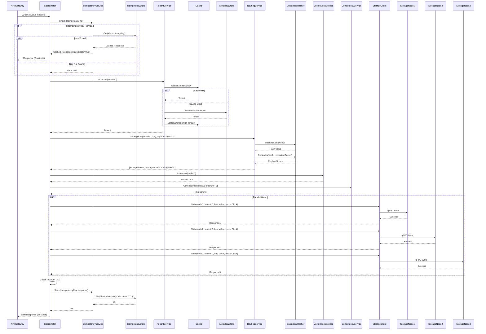
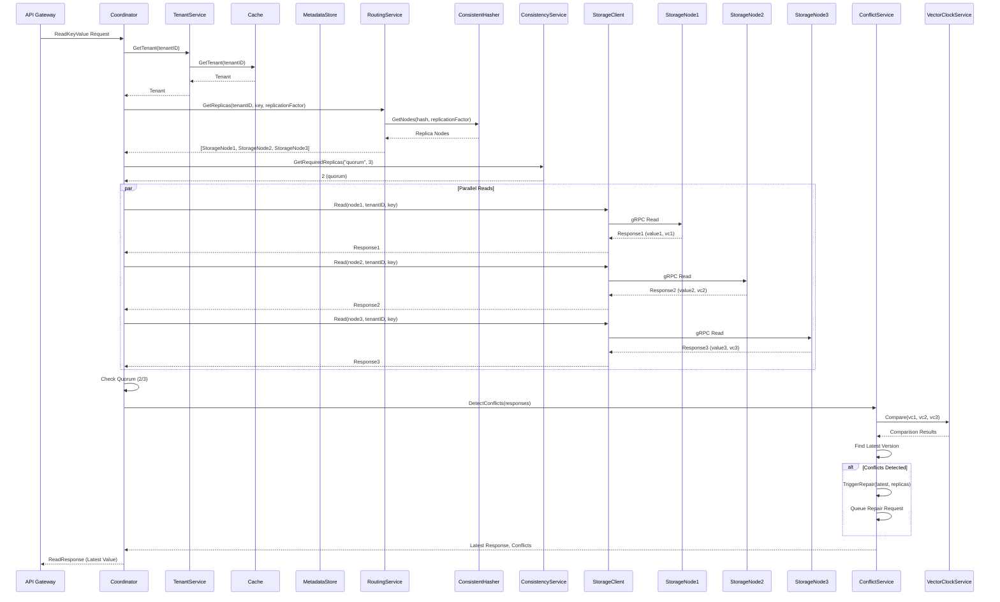
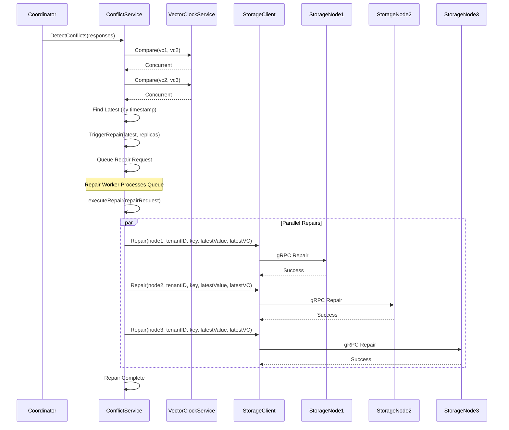
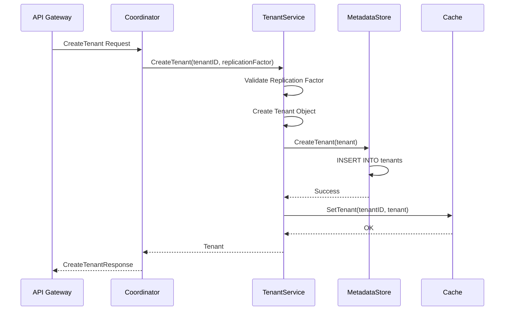
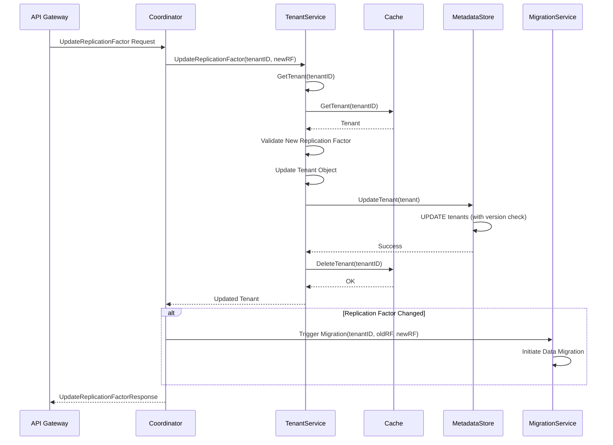
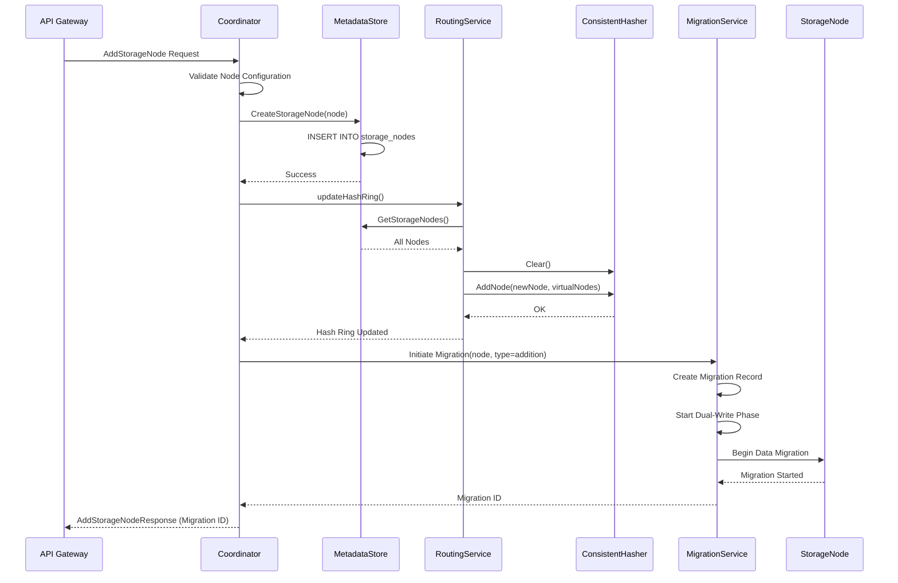
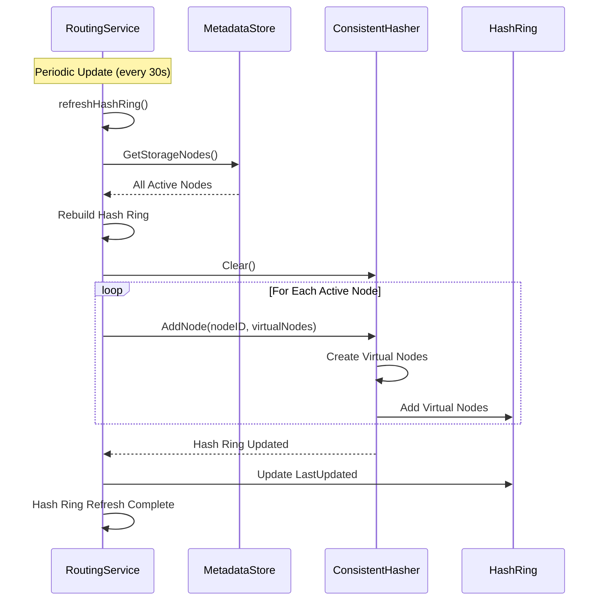
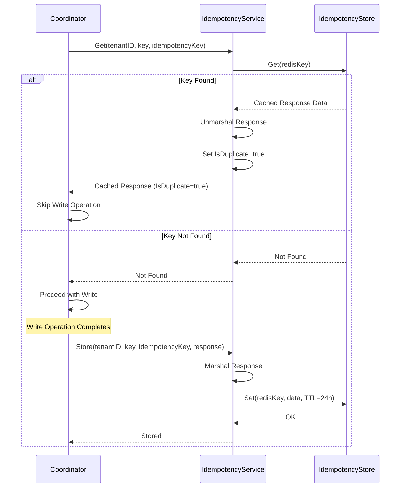

# Coordinator: Sequence Diagrams

This document provides sequence diagrams for all major flows supported by the Coordinator service.

## 1. Write Key-Value Flow (Quorum Consistency)

## 2. Read Key-Value Flow (Quorum Consistency)

## 3. Conflict Resolution Flow

## 4. Create Tenant Flow

## 5. Update Replication Factor Flow

## 6. Add Storage Node Flow

## 7. Hash Ring Update Flow

## 8. Idempotency Check Flow

## Flow Descriptions

### Write Key-Value Flow
1. Check idempotency key (if provided)
2. Get tenant configuration (with caching)
3. Route to storage nodes using consistent hashing
4. Generate vector clock
5. Determine required replicas based on consistency
6. Write to replicas in parallel
7. Check quorum
8. Store idempotency key
9. Return response

### Read Key-Value Flow
1. Get tenant configuration
2. Route to storage nodes
3. Read from replicas in parallel
4. Check quorum
5. Detect conflicts using vector clocks
6. Trigger repair if conflicts found
7. Return latest value

### Conflict Resolution Flow
1. Compare vector clocks from all responses
2. Identify concurrent writes (conflicts)
3. Find latest version by timestamp
4. Queue repair requests
5. Repair workers update stale replicas
6. All replicas synchronized

### Create Tenant Flow
1. Validate replication factor
2. Create tenant in metadata store
3. Cache tenant configuration
4. Return created tenant

### Update Replication Factor Flow
1. Get current tenant
2. Validate new replication factor
3. Update in metadata store (with optimistic locking)
4. Invalidate cache
5. Trigger migration if needed

### Add Storage Node Flow
1. Validate node configuration
2. Create node in metadata store
3. Update hash ring
4. Initiate migration
5. Return migration ID

### Hash Ring Update Flow
1. Periodically refresh from metadata store
2. Rebuild hash ring with all active nodes
3. Update consistent hasher
4. Maintain virtual node distribution

### Idempotency Check Flow
1. Check Redis for idempotency key
2. If found, return cached response
3. If not found, proceed with write
4. Store response in Redis after successful write

