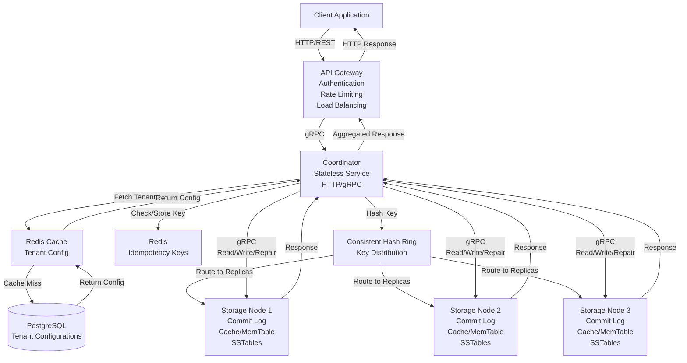

# High-Level Design Document: pairDB Key-Value Store

## 1. Overview

pairDB is a distributed, horizontally scalable key-value store designed for high availability and low latency at decent scale. It supports tunable consistency levels (one, quorum, all), multi-tenancy with per-tenant replication factors, and idempotency for write operations. The system uses a consistent hashing ring for data distribution and vector clocks for conflict resolution.

## 2. Summary of Requirements

### 2.1 Functional Requirements Summary
- Store and retrieve key-value pairs with tenant isolation
- Support tunable consistency levels (one, quorum, all)
- Per-tenant replication factor configuration
- Idempotency for write operations
- Vector clock-based conflict resolution

### 2.2 Non-Functional Requirements Summary
- Optimized for small key-value pairs
- Support decent QPS (thousands to tens of thousands per node)
- Horizontal scalability with automatic scaling
- High availability with quorum-based operations
- Low latency responses

## 3. System Architecture Overview

### 3.1 High-Level Architecture

The system consists of three main layers:

1. **API Gateway Layer**: Entry point for all client requests, handles authentication, rate limiting, and load balancing
2. **Coordinator Layer**: Stateless servers that handle request routing, consistency coordination, and conflict resolution
3. **Storage Layer**: Stateful nodes that store key-value data with multi-layer storage (commit log, cache, memtable, SSTables)

### 3.2 Component Block Diagram

The following diagram shows all components and their interactions from client to storage nodes, including all databases:



#### 3.2.1 ASCII Diagram (Directly Visible in Markdown)

The following ASCII diagram shows the same component interactions and renders directly in markdown files:

```
┌─────────────────────────────────────────────────────────────────────────┐
│                          CLIENT LAYER                                    │
│                    ┌──────────────────────┐                             │
│                    │  Client Application  │                             │
│                    └──────────┬───────────┘                             │
│                               │ HTTP/REST                                │
│                               ▼                                          │
└───────────────────────────────┼──────────────────────────────────────────┘
                                │
┌───────────────────────────────┼──────────────────────────────────────────┐
│                    API GATEWAY LAYER                                     │
│                    ┌──────────────────────┐                              │
│                    │    API Gateway       │                              │
│                    │  - Authentication    │                              │
│                    │  - Rate Limiting    │                              │
│                    │  - Load Balancing   │                              │
│                    └──────────┬───────────┘                              │
│                               │ Route Request                             │
│                               ▼                                          │
└───────────────────────────────┼──────────────────────────────────────────┘
                                │
┌───────────────────────────────┼──────────────────────────────────────────┐
│                    COORDINATOR LAYER                                      │
│                    ┌──────────────────────┐                              │
│                    │    Coordinator      │                              │
│                    │  Stateless Service  │                              │
│                    │    HTTP/gRPC        │                              │
│                    └───────┬──────────────┘                              │
│                            │                                             │
│        ┌───────────────────┼───────────────────┐                        │
│        │                   │                   │                        │
│        ▼                   ▼                   ▼                        │
│  ┌──────────┐      ┌──────────────┐    ┌──────────────┐                 │
│  │  Redis   │◄─────┤  PostgreSQL  │    │    Redis     │                 │
│  │  Cache   │      │  (Metadata) │    │ (Idempotency)│                 │
│  │(Tenant   │      │              │    │              │                 │
│  │ Config)  │      └──────────────┘    └──────────────┘                 │
│  └────┬─────┘                                                           │
│       │                                                                  │
│       └──────────────────────────────────────────────────┐               │
│                                                          │               │
│                    ┌──────────────────────┐             │               │
│                    │  Consistent Hash     │             │               │
│                    │       Ring            │             │               │
│                    └──────────┬───────────┘             │               │
│                               │ Hash Key                 │               │
│                               ▼                          │               │
└───────────────────────────────┼──────────────────────────┼───────────────┘
                                │                          │
┌───────────────────────────────┼──────────────────────────┼───────────────┐
│                    STORAGE LAYER                          │               │
│                               │                          │               │
│        ┌───────────────────────┼──────────────────────┐  │               │
│        │                       │                      │  │               │
│        ▼                       ▼                      ▼  │               │
│  ┌──────────────┐    ┌──────────────┐    ┌──────────────┐              │
│  │ Storage Node │    │ Storage Node │    │ Storage Node │              │
│  │      1       │    │      2       │    │      3       │              │
│  │              │    │              │    │              │              │
│  │ - Commit Log │    │ - Commit Log │    │ - Commit Log │              │
│  │ - Cache      │    │ - Cache      │    │ - Cache      │              │
│  │ - MemTable   │    │ - MemTable   │    │ - MemTable   │              │
│  │ - SSTables   │    │ - SSTables   │    │ - SSTables   │              │
│  └──────┬───────┘    └──────┬───────┘    └──────┬───────┘              │
│         │                   │                   │                      │
│         └───────────────────┼───────────────────┘                      │
│                             │ Response                                 │
│                             ▼                                          │
└─────────────────────────────┼──────────────────────────────────────────┘
                               │
                               │ (Back to Coordinator → Gateway → Client)
```

**Request Flow:**
```
Client → API Gateway → Coordinator
         ↓
    [Fetch Tenant Config from Redis Cache → PostgreSQL if miss]
         ↓
    [Check/Store Idempotency Key in Redis]
         ↓
    [Hash Key using Consistent Hash Ring]
         ↓
    [Route to Storage Node Replicas]
         ↓
    Storage Nodes (Commit Log → MemTable → Cache → SSTables)
         ↓
    [Return Response with Vector Clock]
         ↓
    Coordinator (Aggregate, Compare Vector Clocks, Repair if needed)
         ↓
    API Gateway → Client
```

**Component Interaction Flow:**

1. **Client → API Gateway**: Client sends HTTP/REST requests (POST/GET) to API Gateway
2. **API Gateway → Coordinator**: Gateway authenticates, rate limits, and routes requests to a coordinator
3. **Coordinator → Metadata Store**: 
   - First check Redis cache for tenant configuration
   - On cache miss, fetch from PostgreSQL
   - Cache result in Redis for future requests
4. **Coordinator → Idempotency Store**: Check/store idempotency keys in Redis
5. **Coordinator → Hash Ring**: Use consistent hashing to determine which storage nodes should store/retrieve the key
6. **Coordinator → Storage Nodes**: Send read/write/repair requests to appropriate storage node replicas (gRPC/HTTP)
7. **Storage Nodes**: Process requests through internal layers (Commit Log → MemTable → Cache → SSTables)
8. **Storage Nodes → Coordinator**: Return responses with data and vector clocks
9. **Coordinator**: Aggregate responses, compare vector clocks, trigger repairs if needed
10. **Coordinator → API Gateway**: Return aggregated response
11. **API Gateway → Client**: Return HTTP response to client

### 3.3 Component Overview

#### 3.3.1 API Gateway
- **Purpose**: Entry point for all client requests
- **Protocol**: HTTP server exposing all public APIs
- **Responsibilities**:
  - Authentication and authorization
  - Rate limiting (per tenant)
  - Request routing to coordinators
  - Load balancing across coordinators
  - HTTP to gRPC conversion (converts HTTP requests to gRPC for coordinators)
- **Characteristics**: Stateless, horizontally scalable
- **Technology**: HTTP/REST API gateway (e.g., Kong, Envoy, or custom gateway)
- **Communication**: 
  - Receives: HTTP/REST requests from clients
  - Sends: gRPC requests to coordinator services (HTTP-to-gRPC gateway)

#### 3.3.2 Coordinator Servers
- **Purpose**: Handle QPS and route requests to appropriate storage nodes
- **Protocol**: gRPC service (server)
- **Responsibilities**:
  - Extract tenant ID and fetch tenant configuration
  - Determine replica nodes using consistent hashing
  - Coordinate read/write operations based on consistency level
  - Aggregate responses from multiple replicas
  - Trigger repair operations when conflicts detected
  - Compare vector clocks and resolve conflicts
- **Characteristics**: Stateless, horizontally scalable, can scale up/down dynamically
- **Technology**: gRPC microservice (stateless)
- **Communication**:
  - Receives: gRPC requests from API Gateway (HTTP-to-gRPC conversion)
  - Sends: gRPC requests to Storage Nodes
  - Direct DB access: PostgreSQL (metadata store)
  - Direct access: Redis (idempotency store)
- **Databases Used**:
  - **Metadata Store**: PostgreSQL for tenant configurations (with caching)
  - **Idempotency Store**: Redis for idempotency key storage (fast lookup, TTL support)

#### 3.3.3 Storage Nodes
- **Purpose**: Store and serve key-value data
- **Protocol**: gRPC service (server)
- **Responsibilities**:
  - Store tenant-specific key-value pairs with vector clocks
  - Handle read/write operations with tenant isolation
  - Maintain multi-layer storage (commit log, cache, memtable, SSTables)
  - Write all mutations to commit log first
  - Participate in replication and consistency protocols
- **Characteristics**: Stateful, distributed on consistent hash ring, tenant-aware storage
- **Technology**: Custom storage engine with gRPC interface
- **Communication**:
  - Receives: gRPC requests from Coordinators
  - Local: File system for commit logs and SSTables
  - Gossip Protocol: Peer-to-peer communication with other storage nodes for health checks
- **Storage Components**:
  - **Commit Log**: Append-only log files on disk
  - **In-Memory Cache**: Adaptive cache (LRU + LFU) for frequently accessed keys
  - **MemTable**: In-memory sorted table for recent writes
  - **SSTables**: Immutable sorted string tables on disk (level-based compaction)

#### 3.3.4 Metadata Store
- **Purpose**: Store tenant configurations and metadata
- **Responsibilities**:
  - Store tenant initialization data (tenant ID, replication factor, timestamps)
  - Provide fast lookup of tenant configurations to coordinators
  - Support tenant creation, update, and deletion operations
- **Characteristics**: Highly available, replicated
- **Technology**: 
  - **Primary**: PostgreSQL for persistent storage
  - **Cache**: Redis for fast lookups (coordinator-level caching)

#### 3.3.5 Idempotency Store
- **Purpose**: Store idempotency keys to prevent duplicate writes
- **Responsibilities**:
  - Store idempotency key to response mapping
  - Fast lookup for duplicate request detection
  - TTL-based expiration of old keys
- **Characteristics**: Low latency, high availability, distributed
- **Technology**: Redis (distributed cache with TTL support)

## 4. Data Flow Overview

### 4.1 Write Flow (High-Level)
1. Client sends write request to API Gateway
2. Gateway authenticates and routes to Coordinator
3. Coordinator fetches tenant config from Metadata Store
4. Coordinator determines replica nodes using consistent hashing
5. Coordinator checks idempotency store (if idempotency key provided)
6. Coordinator writes to multiple storage node replicas in parallel
7. Storage nodes write to commit log, then memtable, then cache
8. Coordinator waits for quorum acknowledgments
9. Coordinator stores idempotency key (if applicable)
10. Response returned to client

### 4.2 Read Flow (High-Level)
1. Client sends read request to API Gateway
2. Gateway authenticates and routes to Coordinator
3. Coordinator fetches tenant config from Metadata Store
4. Coordinator determines replica nodes using consistent hashing
5. Coordinator reads from multiple storage node replicas (based on consistency level)
6. Storage nodes check cache → memtable → SSTables
7. Coordinator compares responses and vector clocks
8. Coordinator triggers repair if conflicts detected
9. Response returned to client

## 5. Key Design Decisions

1. **Consistent Hashing**: Enables efficient data distribution and minimal rebalancing
2. **Quorum-based Replication**: Balances consistency and availability
3. **Vector Clocks**: Enables conflict detection without requiring global ordering
4. **Multi-layer Storage**: Commit Log → Cache → MemTable → SSTables for optimal performance
5. **Stateless Coordinators**: Simplifies scaling and load distribution
6. **Parallel Writes**: Reduces write latency compared to sequential replication
7. **Per-Tenant Replication**: Allows tenants to choose their availability/consistency trade-offs
8. **Centralized Metadata Store**: Enables dynamic replication factor changes
9. **Tenant-Aware Hashing**: Ensures data isolation and independent scaling per tenant
10. **Idempotency Keys**: Client-provided or server-generated keys ensure exactly-once semantics
11. **Redis for Idempotency**: Fast, distributed cache with TTL support for idempotency keys
12. **PostgreSQL for Metadata**: Reliable, ACID-compliant storage for tenant configurations

## 6. Technology Stack Summary

### 6.1 API Gateway
- **Protocol**: HTTP server exposing all public APIs
- **Technology**: HTTP server (Kong, Envoy, or custom)
- **Responsibilities**: 
  - Expose REST APIs to clients
  - Authentication and authorization
  - Rate limiting middleware
  - Request routing to coordinator nodes
- **Communication**: HTTP requests to coordinator gRPC service (via HTTP-to-gRPC gateway or direct gRPC)

### 6.2 Coordinator Service
- **Protocol**: gRPC service (server)
- **Technology**: gRPC microservice (stateless)
- **Language**: Go, Java, or Python (recommended: Go)
- **Responsibilities**:
  - Receive requests from API Gateway (via gRPC)
  - Process and route to storage nodes (via gRPC)
  - Handle consistency coordination
- **Communication**: 
  - Receives: gRPC requests from API Gateway
  - Sends: gRPC requests to Storage Nodes
  - Direct DB access: PostgreSQL (metadata store)
  - Direct access: Redis (idempotency store)

### 6.3 Storage Node
- **Protocol**: gRPC service (server)
- **Technology**: Custom storage engine with gRPC interface
- **Language**: Go, C++, or Rust (recommended: Go)
- **Responsibilities**:
  - Receive gRPC requests from coordinators
  - Store and retrieve key-value data
  - Manage multi-layer storage (commit log, cache, memtable, SSTables)
- **Communication**: 
  - Receives: gRPC requests from Coordinators
  - Local: File system for commit logs and SSTables
  - Gossip Protocol: Peer-to-peer health checks with other storage nodes

### 6.4 Metadata Store
- **Primary**: PostgreSQL (persistent, ACID-compliant)
- **Cache**: Redis (fast lookups, coordinator-level caching)

### 6.5 Idempotency Store
- **Primary**: Redis (distributed cache, TTL support, fast lookups)
- **Lock Mechanism**: Redis SETNX for distributed locks

### 6.6 Infrastructure
- **Container Orchestration**: Kubernetes (K8s)
  - StatefulSets for storage nodes (persistent volumes)
  - Deployments for coordinators (stateless, HPA enabled)
  - Services for load balancing and service discovery
- **Service Discovery**: Kubernetes DNS and service discovery
- **Load Balancing**: Kubernetes Service (ClusterIP/LoadBalancer) and Ingress
- **Monitoring and Observability**: 
  - Prometheus for metrics collection
  - Grafana for visualization
  - Gossip protocol for storage node health checks

## 7. Scalability Considerations (Simplified for Decent Scale)

### 7.1 Coordinator Scaling
- **Solution**: Horizontal scaling with load balancer
- **Caching**: Aggressive caching of tenant configs (TTL-based with invalidation)
- **Connection Pooling**: Reuse connections to storage nodes

### 7.2 Storage Node Scaling

#### 7.2.1 Node Addition Process (Cassandra Pattern - Phase 2 Streaming)

**API Call**: `POST /v1/admin/storage-nodes`

**Implementation**: Phase 2 streaming approach inspired by Apache Cassandra's bootstrapping mechanism

**Process Flow**:
1. **Immediate Ring Addition**: Admin calls API to add new storage node
   - Coordinator validates node configuration (host, port, virtual nodes)
   - Node is immediately added to consistent hash ring with `bootstrapping` status
   - New node starts receiving writes immediately (even before historical data is transferred)

2. **Parallel Streaming Initiation**: Coordinator calculates key ranges to transfer
   - Uses consistent hashing to determine which key ranges move from old nodes to new node
   - For each virtual node of the new node, identifies the previous owner
   - Initiates parallel streaming from multiple old nodes simultaneously

3. **Three-Phase Streaming**:
   - **Bulk Copy Phase**: Old nodes scan their data (MemTable + SSTables) and send matching keys
   - **Live Streaming Phase**: New writes during bulk copy are forwarded to new node via hinted handoff
   - **Sync Verification Phase**: Final check to ensure all data is transferred

4. **Background Monitoring**: Coordinator polls streaming status every 10 seconds
   - Tracks completion per source node
   - Aggregates progress (keys copied, keys streamed, bytes transferred)
   - Timeout: 1 hour (360 attempts × 10s)

5. **Automatic Transition**: When all streaming completes
   - Node status automatically transitions from `bootstrapping` to `active`
   - Streaming contexts cleaned up
   - Node fully integrated into cluster

6. **Rollback on Failure**: If streaming times out
   - Node removed from hash ring
   - Streaming operations stopped
   - Node status set to `failed` (audit trail preserved)
   - System continues operating normally

**Request Handling During Addition**:
- **Writes**:
  - Immediately routed to new node (Cassandra pattern)
  - Write-ahead via hinted handoff ensures no data loss
  - New node participates in write quorum calculations
- **Reads**:
  - Bootstrapping nodes included in read queries
  - Ensures read consistency during topology changes
  - May return incomplete data initially (handled by read repair)
- **Quorum**:
  - Calculated based on active replicas only (excludes bootstrapping nodes)
  - Prevents false quorum from nodes with incomplete data
  - Automatically adjusted as nodes transition to active

#### 7.2.2 Node Deletion Process (Phase 2 Streaming)

**API Call**: `DELETE /v1/admin/storage-nodes/{node_id}`

**Implementation**: Phase 2 streaming approach with data replication before removal

**Process Flow**:
1. **Validation**: Admin calls API to remove storage node
   - Coordinator validates sufficient nodes remain after removal
   - Minimum 3 active nodes required (configurable)
   - Force flag available for emergency removals

2. **Draining Phase**: Node marked as `draining`
   - Node status updated to `draining` in metadata store
   - **CRITICAL**: Hash ring immediately updated via `ForceUpdateHashRing()` (synchronous)
   - Node excluded from hash ring, stops accepting new writes
   - Existing data must be transferred to inheriting nodes
   - Inheriting nodes (e.g., node D) immediately start receiving writes for reassigned key ranges

3. **Parallel Streaming to Inheritors**: Coordinator calculates inheriting nodes
   - Determines which nodes will take over key ranges
   - Initiates parallel streaming from draining node to multiple inheritors
   - Each inheritor receives its designated key ranges

4. **Background Monitoring**: Coordinator polls streaming status
   - Tracks completion per inheriting node
   - Monitors replication progress
   - Timeout: 1 hour (360 attempts × 10s)

5. **Complete Removal**: When all streaming completes
   - Node removed from hash ring
   - Node removed from metadata store
   - Streaming contexts cleaned up
   - Node can be safely shut down

6. **Rollback on Failure**: If streaming times out
   - Node reactivated (status changed back to `active`)
   - Streaming operations stopped
   - System continues with node still operational
   - Admin alerted to retry or investigate

**Request Handling During Deletion**:
- **Writes**: Routed only to remaining active nodes (draining node excluded)
- **Reads**: Routed only to remaining active nodes
- **Quorum**: Calculated from remaining active nodes only
- **Validation**: Ensures minimum replicas maintained throughout process

#### 7.2.3 Data Migration Details (Phase 2 Streaming)

**Migration Coordination**:
- Node status stored in metadata store (PostgreSQL): `active`, `bootstrapping`, `draining`, `failed`
- Any coordinator can handle node operations (distributed coordination)
- Topology lock prevents concurrent node additions/removals
- Background goroutines monitor streaming progress

**Streaming APIs**:
- Storage nodes expose streaming APIs:
  - `StartStreaming`: Initiate key range streaming from source to target
  - `GetStreamStatus`: Check streaming progress (keys copied, keys streamed, state)
  - `StopStreaming`: Cleanup streaming context after completion
  - `ReceiveStreamedData`: Accept streamed keys from source nodes

**Key Range Calculation**:
- **KeyRangeService**: Calculates which key ranges move between nodes
- **Algorithm**:
  1. Clone current hash ring
  2. Add/remove target node from cloned ring
  3. For each virtual node affected, determine old/new owner
  4. Calculate hash ranges: [previousHash, currentHash)
  5. Group ranges by source node for parallel streaming

**Streaming Implementation**:
- **Hash-based Scanning**: Storage nodes scan MemTable and SSTables by hash range
- **Parallel Transfers**: Multiple source nodes stream to target simultaneously
- **Live Forwarding**: New writes during streaming forwarded via hinted handoff
- **Progress Tracking**: Coordinator aggregates status from all streaming operations

**Performance Optimizations**:
- Background streaming minimizes impact on normal operations
- Throttling available to control bandwidth usage
- No global cutover phase (Cassandra pattern)
- Checkpointed progress via streaming status

**Failure Handling**:
- **Timeout**: 1-hour timeout with automatic rollback
- **Rollback Logic**:
  - Node addition: Remove from ring, mark as failed
  - Node removal: Reactivate node, continue operations
- **Cleanup**: Stop streaming, cleanup contexts, update metadata
- **Audit Trail**: Failed operations preserved in metadata store

**Commit Log**: Single commit log per node (sufficient for decent scale)
**Compaction**: Background compaction process

### 7.3 Metadata Store Scaling
- **Solution**: PostgreSQL with read replicas, Redis caching layer
- **Caching Strategy**: Coordinator-level caching with TTL and invalidation

### 7.4 Idempotency Store Scaling
- **Solution**: Redis cluster for horizontal scaling
- **TTL**: 24-hour TTL for idempotency keys (sufficient for retries)
- **Eviction**: LRU eviction if memory pressure

## 8. Edge Cases and Solutions

### 8.1 Concurrent Writes with Same Idempotency Key
- **Solution**: Redis distributed lock (SETNX) with 30-second timeout
- **Implementation**: First request acquires lock, subsequent requests wait and return cached response

### 8.2 Idempotency Store Failure
- **Solution**: Graceful degradation - continue operating without idempotency (log warnings)
- **Fallback**: Rely on vector clocks for conflict detection

### 8.3 Data Migration During Replication Factor Change
- **Solution**: Dual-write phase - write to both old and new replicas during migration
- **Phased Approach**: Add replicas → dual-write → cutover → cleanup

### 8.4 Vector Clock Conflicts
- **Solution**: Last-write-wins based on timestamp (simple, sufficient for decent scale)
- **Repair**: Coordinator triggers repair operation to sync replicas

### 8.5 Partial Write Failures
- **Solution**: Retry logic to reach quorum
- **Store Idempotency**: Only store idempotency key after quorum reached

### 8.6 Read Staleness During Node Addition
- **Problem**: Bootstrapping nodes may not have complete historical data
- **Solution**:
  - Include bootstrapping nodes in read queries immediately
  - Use read repair to detect and fix inconsistencies
  - Eventual consistency guarantees convergence

### 8.7 Race Conditions During Topology Changes
- **Problem**: Concurrent node additions/removals can corrupt hash ring
- **Solution**:
  - Topology mutex prevents concurrent operations
  - ConsistentHasher uses internal RWMutex for thread safety
  - Serialized topology changes through single coordinator lock

### 8.8 Quorum Calculation During Dual-Write
- **Problem**: Bootstrapping nodes counted in quorum but may not have all data
- **Solution**:
  - Quorum calculated based on active replicas only
  - Bootstrapping/draining nodes excluded from quorum count
  - `CountActiveReplicas()` method filters by node status

### 8.9 Migration Failure Recovery
- **Problem**: Streaming can timeout or fail midway
- **Solution**:
  - **Node Addition**: Automatic rollback removes node, marks as failed
  - **Node Removal**: Automatic rollback reactivates node
  - 1-hour timeout with background monitoring
  - Audit trail preserved in metadata store

### 8.10 Insufficient Replicas After Node Removal
- **Problem**: Removing node could drop below minimum replication requirements
- **Solution**:
  - Validation checks minimum 3 active nodes remain
  - Removal blocked if insufficient nodes (unless force flag)
  - Prevents data availability issues

### 8.11 Read-Modify-Write Vector Clock Staleness
- **Problem**: During node addition, read-modify-write may read stale data
- **Solution**:
  - Conflict detection via vector clock comparison
  - Read repair triggered when conflicts detected
  - System converges to consistency through anti-entropy

### 8.12 Concurrent Addition and Deletion
- **Problem**: Simultaneous add/remove operations can cause conflicts
- **Solution**: Topology mutex serializes all node operations

### 8.13 "ALL" Consistency During Node Deletion - Hash Ring Update Race Condition
- **Problem**: When node C is removed and replica set changes from [A, B, C] to [A, B, D]:
  - Node C is marked as `draining` status in metadata store
  - Hash ring is updated periodically (every 30 seconds by default)
  - During this window, writes with "ALL" consistency still go to [A, B, C]
  - Node D doesn't receive writes until the next periodic hash ring update
  - This creates a race condition where new replica D misses writes for up to 30 seconds
- **Solution**:
  - **Immediate Hash Ring Update**: Call `ForceUpdateHashRing()` immediately after marking node as draining
  - This ensures the hash ring is updated synchronously, excluding the draining node
  - Writes are immediately redirected to the new replica set [A, B, D]
  - No race condition window where draining node receives writes
  - Implementation: `node_handler_v2.go` line 271-279, `routing_service.go` line 224-233

**Flow Diagram:**
```
Without Fix (Race Condition):
  1. Admin: DELETE /storage-nodes/C
  2. Coordinator: Mark C as "draining" in metadata store
  3. [TIME WINDOW: 0-30 seconds]
     - Hash ring still contains C
     - Write request arrives for key "user:123"
     - GetReplicas() → [A, B, C]  ❌ Wrong! Should be [A, B, D]
     - Write goes to A, B, C (D misses the write)
  4. [After 30 seconds]
     - Background updateHashRing() runs
     - Hash ring updated: C excluded, D included
     - Future writes go to [A, B, D] ✓

With Fix (Immediate Update):
  1. Admin: DELETE /storage-nodes/C
  2. Coordinator: Mark C as "draining" in metadata store
  3. Coordinator: ForceUpdateHashRing() ← NEW!
     - Hash ring immediately updated: C excluded
     - C's key ranges reassigned to D
  4. Write request arrives for key "user:123"
     - GetReplicas() → [A, B, D]  ✓ Correct!
     - Write goes to A, B, D (all replicas receive write)
```

**Key Insight**: The fix ensures that once a node is marked as draining, the hash ring is immediately updated before any subsequent writes can occur, eliminating the race condition window.

## 9. Monitoring and Observability

### 9.1 Health Checks

**Storage Node Health Checks**:
- **Gossip Protocol**: Storage nodes use gossip protocol for health checks
- **Peer-to-Peer Communication**: Nodes exchange health status with peers
- **Failure Detection**: Fast detection of node failures through gossip
- **Health Status Propagation**: Health status propagates through gossip network
- **Benefits**: 
  - Decentralized health monitoring
  - Fast failure detection
  - No single point of failure
  - Self-organizing network

**Gossip Protocol Implementation**:
- Nodes periodically exchange health status with random peers
- Health status includes: node_id, status (healthy/degraded/unhealthy), timestamp, metrics
- Failed nodes are quickly identified and removed from routing
- Coordinator nodes subscribe to gossip events for routing updates

### 9.2 Metrics Collection

- **QPS**: Requests per second per component
- **Latency**: P50, P95, P99 percentiles
- **Error Rates**: By error type and component
- **Resource Usage**: CPU, memory, disk per node
- **Cache Hit Rates**: For tenant config and idempotency stores
- **Vector Clock Conflicts**: Conflict detection and repair rates
- **Migration Progress**: For node additions/deletions

### 9.3 Observability Stack

- **Metrics**: Prometheus for metrics collection
- **Visualization**: Grafana for dashboards
- **Logging**: Centralized logging (ELK stack or similar)
- **Tracing**: Distributed tracing for request flows (optional)

## 10. Deployment Architecture

### 10.1 Container Orchestration

**Platform**: Kubernetes (K8s)

**Deployment Strategy**:
- **API Gateway**: Kubernetes Deployment with HorizontalPodAutoscaler (HPA)
- **Coordinators**: Kubernetes Deployment (stateless, HPA enabled)
- **Storage Nodes**: Kubernetes StatefulSet (stateful, persistent volumes)
- **Metadata Store**: PostgreSQL deployed as StatefulSet or managed service
- **Idempotency Store**: Redis deployed as StatefulSet or managed service

### 10.2 Kubernetes Resources

**StatefulSets for Storage Nodes**:
- Persistent volumes for commit logs and SSTables
- Stable network identities (headless service)
- Ordered deployment and scaling
- Pod disruption budgets for availability

**Deployments for Coordinators**:
- Stateless pods, can scale horizontally
- Service for load balancing
- ConfigMaps for configuration
- Secrets for database credentials

**Services**:
- ClusterIP services for internal communication
- LoadBalancer or Ingress for external API Gateway access

### 10.3 Configuration Management

- **ConfigMaps**: For non-sensitive configuration (cache sizes, TTLs, etc.)
- **Secrets**: For sensitive data (database passwords, API keys)
- **Environment Variables**: For runtime configuration

## 11. Implementation TODO List

The following items are planned for future implementation:

### 11.1 Tenant Data Migration Strategy

- [ ] Detailed design for tenant data migration during replication factor changes
- [ ] Migration API specifications
- [ ] Migration progress tracking and resumability
- [ ] Migration rollback mechanisms
- [ ] Performance optimization for large tenant migrations

### 11.2 Security and Encryption

- [ ] Tenant data isolation implementation details
- [ ] Encryption at rest for commit logs and SSTables
- [ ] Encryption in transit (TLS) for all communications
- [ ] Key management system integration
- [ ] Access control and authorization policies
- [ ] Audit logging for security events

### 11.3 Backup and Disaster Recovery

- [ ] Backup strategy for storage nodes
- [ ] Backup frequency and retention policies
- [ ] Point-in-time recovery mechanisms
- [ ] Disaster recovery procedures
- [ ] Cross-region backup replication
- [ ] Backup verification and testing procedures

### 11.4 Cross-Datacenter Replication

- [ ] Commit log replication for cross-datacenter replication
- [ ] Multi-datacenter deployment architecture
- [ ] Data synchronization strategies
- [ ] Conflict resolution across datacenters
- [ ] Network partition handling
- [ ] Latency optimization for cross-DC operations

## 12. Next Steps

Detailed design documents for:
- API Contracts (see `api-contracts.md`)
- Coordinator Design (see `coordinator/design.md`)
- Storage Node Design (see `storage-node/design.md`)

