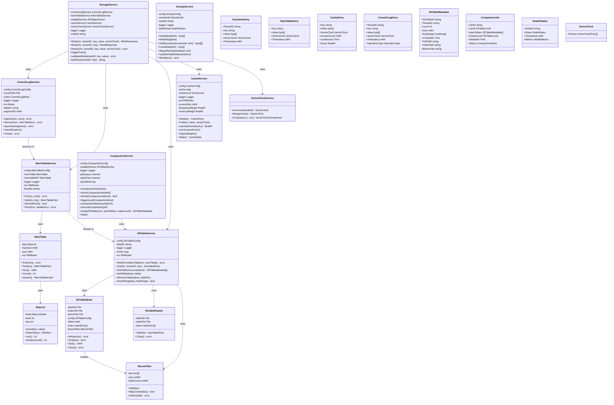

# Storage Node: Class Diagram

This document provides a class diagram showing the core entities and their relationships in the Storage Node service.

## Class Diagram

## Class Descriptions

### StorageService
- Main service orchestrating all storage operations
- Coordinates writes through commit log, memtable, and cache
- Handles reads from cache, memtable, and SSTables
- Manages repair operations

### CommitLogService
- Manages write-ahead log (WAL) for durability
- Handles log rotation and segment management
- Recovers data from commit logs on startup
- Ensures data persistence

### MemTableService
- Manages in-memory sorted table for recent writes
- Handles memtable flushing to SSTables
- Supports immutable memtable during flush
- Provides fast write and read operations

### MemTable
- In-memory sorted table using skip list
- Tracks size and entry count
- Provides iterator for flushing
- Thread-safe operations

### SkipList
- Probabilistic data structure for O(log n) operations
- Supports insert, search, and iteration
- Used as underlying structure for memtable

### SSTableService
- Manages SSTable files organized by levels
- Handles writing from memtable to L0 SSTables
- Provides read operations with bloom filter optimization
- Manages SSTable metadata and indexing

### SSTableWriter
- Writes SSTable files with data, index, and bloom filter
- Maintains offset tracking for indexing
- Finalizes SSTable with metadata

### SSTableReader
- Reads from SSTable files using index
- Provides fast key lookups
- Handles file I/O operations

### BloomFilter
- Probabilistic data structure for membership testing
- Reduces unnecessary disk I/O
- Configurable false positive rate

### CacheService
- Adaptive cache combining LRU and LFU
- Dynamically adjusts weights based on workload
- Evicts entries based on adaptive score
- Tracks access patterns

### CompactionService
- Background service for SSTable compaction
- Manages compaction jobs and workers
- Triggers compaction based on level thresholds
- Merges SSTables to optimize storage

### VectorClockService
- Manages vector clocks for causality tracking
- Compares and merges vector clocks
- Supports conflict detection

### GossipService
- Implements gossip protocol for health monitoring
- Broadcasts node health status
- Receives health updates from other nodes
- Integrates with memberlist library

