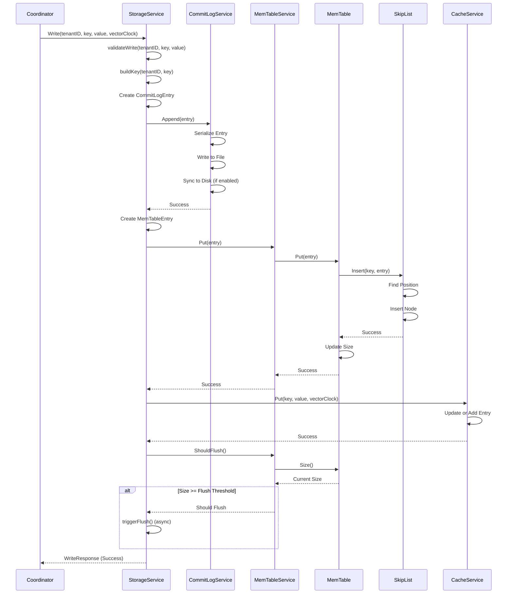
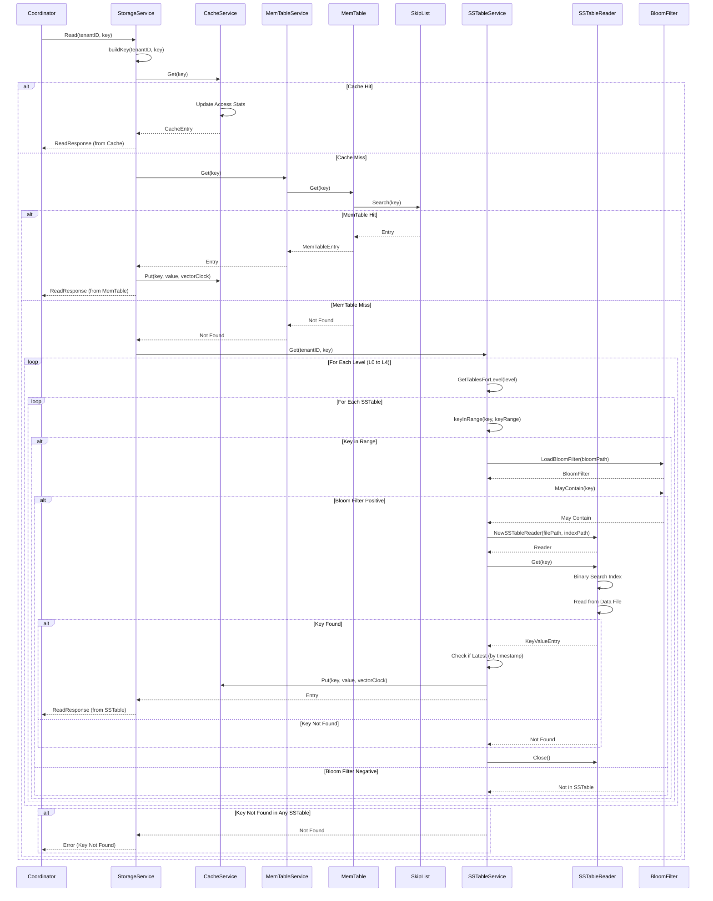
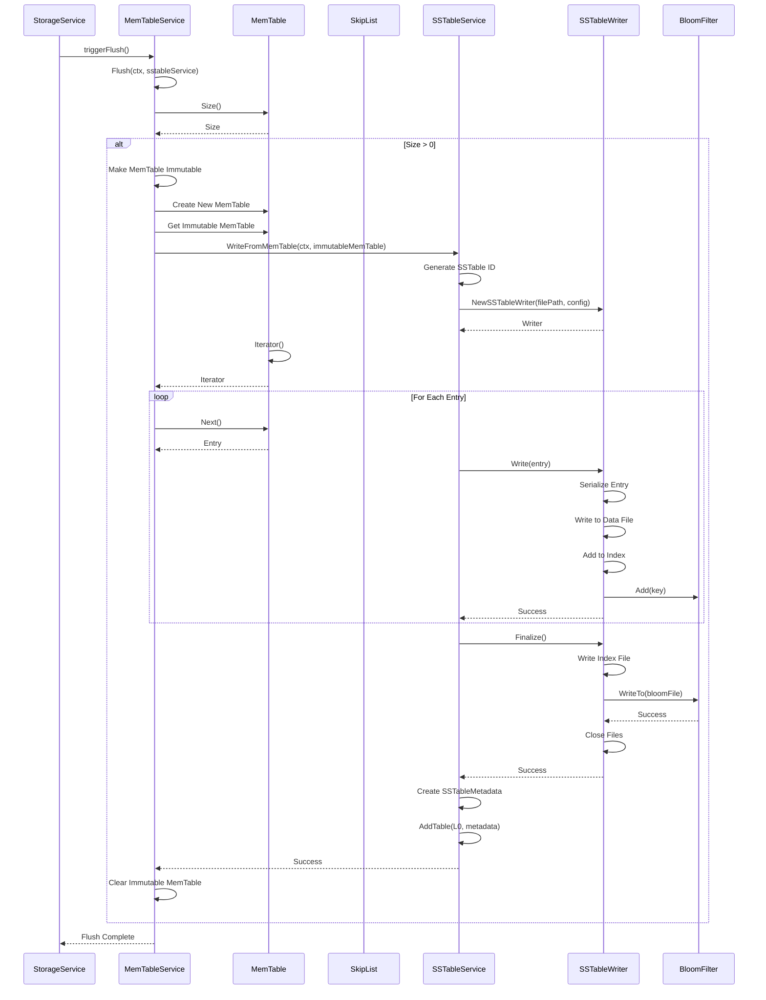
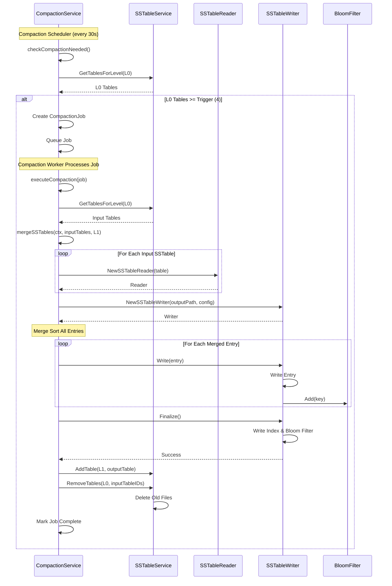
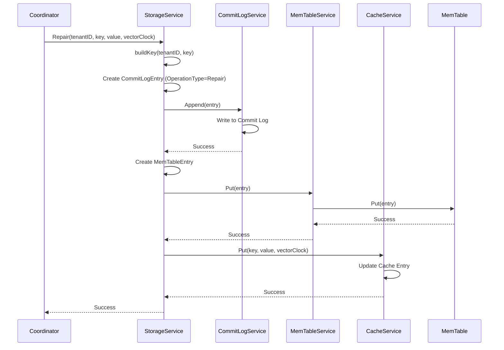
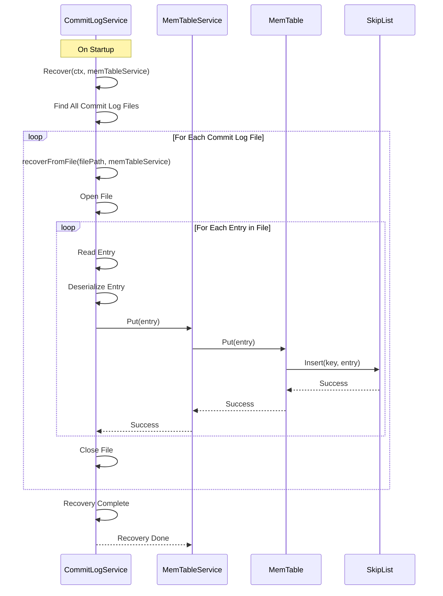
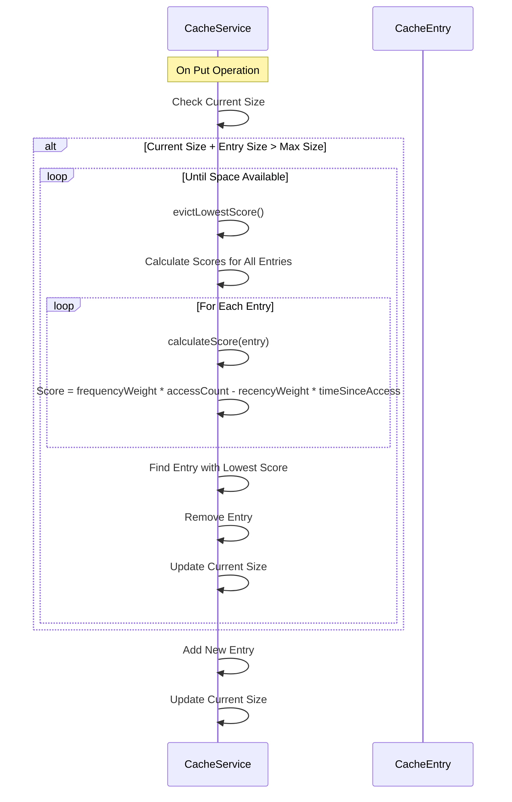
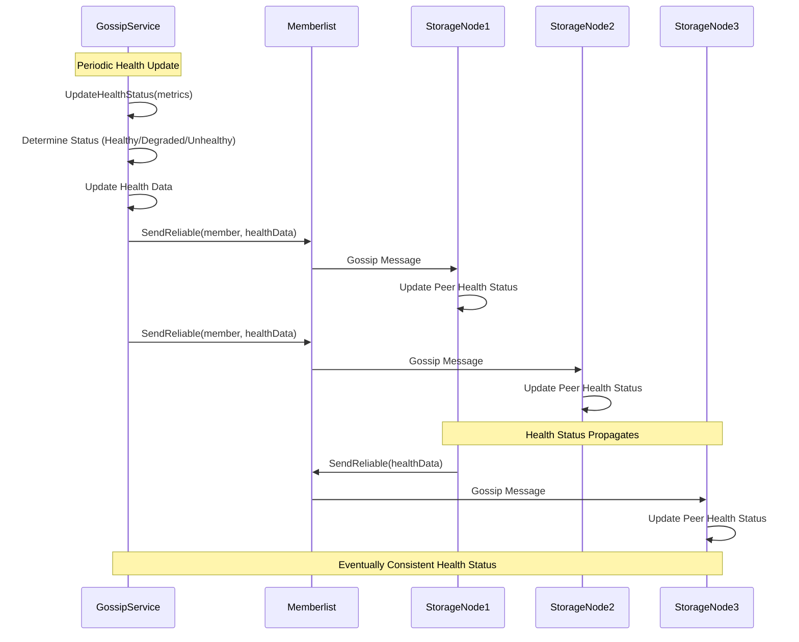

# Storage Node: Sequence Diagrams

This document provides sequence diagrams for all major flows supported by the Storage Node service.

## 1. Write Operation Flow

## 2. Read Operation Flow

## 3. MemTable Flush Flow

## 4. Compaction Flow

## 5. Repair Operation Flow

## 6. Commit Log Recovery Flow

## 7. Cache Eviction Flow

## 8. Gossip Health Monitoring Flow

## Flow Descriptions

### Write Operation Flow
1. Validate write parameters
2. Write to commit log (durability)
3. Write to memtable (in-memory)
4. Update cache
5. Check if memtable needs flushing
6. Return success

### Read Operation Flow
1. Check cache first (fastest)
2. If cache miss, check memtable
3. If memtable miss, search SSTables (L0 to L4)
4. Use bloom filter to skip non-existent keys
5. Binary search index for fast lookup
6. Return latest version based on timestamp
7. Update cache with retrieved value

### MemTable Flush Flow
1. Check if memtable size exceeds threshold
2. Make current memtable immutable
3. Create new memtable for writes
4. Iterate through immutable memtable
5. Write entries to new L0 SSTable
6. Create index and bloom filter
7. Add SSTable metadata to L0
8. Clear immutable memtable

### Compaction Flow
1. Scheduler checks compaction triggers
2. If L0 has enough SSTables, create compaction job
3. Worker merges multiple SSTables
4. Sort and deduplicate entries
5. Write merged SSTable to next level
6. Remove old SSTables
7. Update SSTable metadata

### Repair Operation Flow
1. Receive repair request with latest value
2. Write to commit log
3. Update memtable
4. Update cache
5. Ensure all layers have latest version

### Commit Log Recovery Flow
1. On startup, scan commit log directory
2. Read all commit log files
3. Replay entries to memtable
4. Restore in-memory state
5. Ready for normal operations

### Cache Eviction Flow
1. Check cache size on put
2. If full, calculate scores for all entries
3. Evict entry with lowest adaptive score
4. Repeat until space available
5. Add new entry

### Gossip Health Monitoring Flow
1. Periodically update local health status
2. Broadcast to random peers
3. Receive health updates from peers
4. Propagate through cluster
5. Eventually consistent health view

