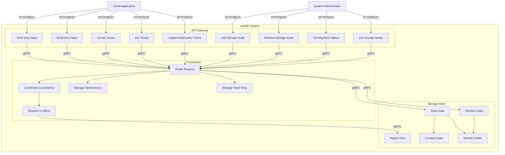

# pairDB: Global Use Case Diagram

This document provides a comprehensive use case diagram for the pairDB distributed key-value store system, showing all actors and their interactions with the system.

## Use Case Diagram

## Use Case Descriptions

### Client Use Cases

#### UC1: Write Key-Value
- **Actor**: Client Application
- **Description**: Store a key-value pair with optional idempotency key and consistency level
- **Preconditions**: Client authenticated, tenant exists
- **Postconditions**: Key-value pair stored in multiple replicas based on consistency level
- **Flow**: Client → API Gateway → Coordinator → Storage Nodes

#### UC2: Read Key-Value
- **Actor**: Client Application
- **Description**: Retrieve a key-value pair with specified consistency level
- **Preconditions**: Client authenticated, tenant exists
- **Postconditions**: Key-value pair returned with vector clock information
- **Flow**: Client → API Gateway → Coordinator → Storage Nodes

#### UC3: Create Tenant
- **Actor**: Client Application
- **Description**: Create a new tenant with specified replication factor
- **Preconditions**: Client authenticated with admin privileges
- **Postconditions**: New tenant created in metadata store
- **Flow**: Client → API Gateway → Coordinator → Metadata Store

#### UC4: Get Tenant
- **Actor**: Client Application
- **Description**: Retrieve tenant configuration information
- **Preconditions**: Client authenticated, tenant exists
- **Postconditions**: Tenant configuration returned
- **Flow**: Client → API Gateway → Coordinator → Metadata Store

#### UC5: Update Replication Factor
- **Actor**: Client Application
- **Description**: Update replication factor for an existing tenant
- **Preconditions**: Client authenticated, tenant exists
- **Postconditions**: Replication factor updated, data migration may be triggered
- **Flow**: Client → API Gateway → Coordinator → Metadata Store

### Administrator Use Cases

#### UC6: Add Storage Node
- **Actor**: System Administrator
- **Description**: Add a new storage node to the cluster
- **Preconditions**: Admin authenticated, node configuration valid
- **Postconditions**: Node added to hash ring, data migration initiated
- **Flow**: Admin → API Gateway → Coordinator → Migration Service

#### UC7: Remove Storage Node
- **Actor**: System Administrator
- **Description**: Remove a storage node from the cluster
- **Preconditions**: Admin authenticated, sufficient replicas exist
- **Postconditions**: Node removed from hash ring, data migrated to other nodes
- **Flow**: Admin → API Gateway → Coordinator → Migration Service

#### UC8: Get Migration Status
- **Actor**: System Administrator
- **Description**: Check the status of an ongoing migration
- **Preconditions**: Admin authenticated, migration ID valid
- **Postconditions**: Migration status and progress returned
- **Flow**: Admin → API Gateway → Coordinator → Migration Service

#### UC9: List Storage Nodes
- **Actor**: System Administrator
- **Description**: List all storage nodes in the cluster with their status
- **Preconditions**: Admin authenticated
- **Postconditions**: List of storage nodes returned
- **Flow**: Admin → API Gateway → Coordinator → Metadata Store

### Coordinator Use Cases

#### UC10: Route Request
- **Actor**: Coordinator Service
- **Description**: Route requests to appropriate storage nodes using consistent hashing
- **Preconditions**: Hash ring initialized, storage nodes available
- **Postconditions**: Request routed to correct replicas

#### UC11: Coordinate Consistency
- **Actor**: Coordinator Service
- **Description**: Coordinate read/write operations based on consistency level (one, quorum, all)
- **Preconditions**: Replicas identified, consistency level specified
- **Postconditions**: Operation completed with required consistency guarantees

#### UC12: Resolve Conflicts
- **Actor**: Coordinator Service
- **Description**: Detect and resolve conflicts using vector clocks
- **Preconditions**: Multiple conflicting values detected
- **Postconditions**: Conflicts resolved, repair operations triggered if needed

#### UC13: Manage Idempotency
- **Actor**: Coordinator Service
- **Description**: Handle idempotency keys to prevent duplicate writes
- **Preconditions**: Idempotency key provided or generated
- **Postconditions**: Duplicate requests detected and handled appropriately

#### UC14: Manage Hash Ring
- **Actor**: Coordinator Service
- **Description**: Maintain consistent hash ring for data distribution
- **Preconditions**: Storage nodes registered
- **Postconditions**: Hash ring updated with current node topology

### Storage Node Use Cases

#### UC15: Store Data
- **Actor**: Storage Node Service
- **Description**: Store key-value pair in commit log, memtable, and cache
- **Preconditions**: Write request received, storage available
- **Postconditions**: Data persisted and available for reads

#### UC16: Retrieve Data
- **Actor**: Storage Node Service
- **Description**: Retrieve key-value pair from cache, memtable, or SSTables
- **Preconditions**: Read request received, key exists
- **Postconditions**: Value returned with vector clock information

#### UC17: Repair Data
- **Actor**: Storage Node Service
- **Description**: Repair stale data based on latest vector clock
- **Preconditions**: Repair request received
- **Postconditions**: Data updated to latest version

#### UC18: Compact Data
- **Actor**: Storage Node Service
- **Description**: Compact SSTables to optimize storage and performance
- **Preconditions**: Compaction trigger conditions met
- **Postconditions**: SSTables compacted, old files removed

#### UC19: Monitor Health
- **Actor**: Storage Node Service
- **Description**: Monitor node health and broadcast status via gossip protocol
- **Preconditions**: Gossip protocol enabled
- **Postconditions**: Health status propagated to cluster

## Actor Descriptions

### Client Application
- Represents external applications that use pairDB for storing and retrieving key-value data
- Interacts with the system via REST API through API Gateway
- Requires authentication token with tenant information

### System Administrator
- Represents system administrators who manage the pairDB cluster
- Performs administrative operations like adding/removing nodes and monitoring migrations
- Requires admin-level authentication

## System Boundaries

The pairDB system consists of three main layers:
1. **API Gateway Layer**: Entry point for all client requests
2. **Coordinator Layer**: Handles routing, consistency, and conflict resolution
3. **Storage Layer**: Stores and retrieves key-value data

## Relationships

- **Client → API Gateway**: All client requests go through API Gateway
- **API Gateway → Coordinator**: API Gateway forwards requests to Coordinator via gRPC
- **Coordinator → Storage Nodes**: Coordinator routes requests to appropriate storage nodes
- **Coordinator → Metadata Store**: Coordinator accesses tenant and node metadata
- **Coordinator → Idempotency Store**: Coordinator manages idempotency keys
- **Storage Nodes**: Communicate via gossip protocol for health monitoring

