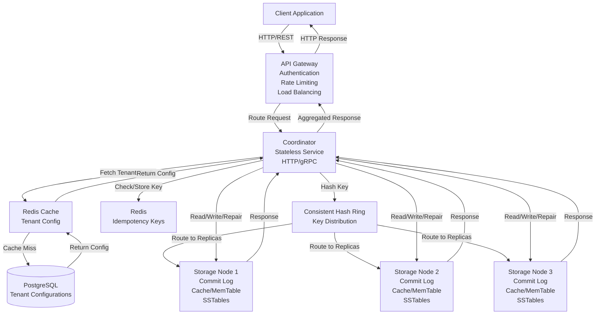

# High-Level Design Document: pairDB Key-Value Store

## 1. Overview

pairDB is a distributed, horizontally scalable key-value store designed for high availability and low latency at decent scale. It supports tunable consistency levels (one, quorum, all), multi-tenancy with per-tenant replication factors, and idempotency for write operations. The system uses a consistent hashing ring for data distribution and vector clocks for conflict resolution.

## 2. Summary of Requirements

### 2.1 Functional Requirements Summary
- Store and retrieve key-value pairs with tenant isolation
- Support tunable consistency levels (one, quorum, all)
- Per-tenant replication factor configuration
- Idempotency for write operations
- Vector clock-based conflict resolution

### 2.2 Non-Functional Requirements Summary
- Optimized for small key-value pairs
- Support decent QPS (thousands to tens of thousands per node)
- Horizontal scalability with automatic scaling
- High availability with quorum-based operations
- Low latency responses

## 3. System Architecture Overview

### 3.1 High-Level Architecture

The system consists of three main layers:

1. **API Gateway Layer**: Entry point for all client requests, handles authentication, rate limiting, and load balancing
2. **Coordinator Layer**: Stateless servers that handle request routing, consistency coordination, and conflict resolution
3. **Storage Layer**: Stateful nodes that store key-value data with multi-layer storage (commit log, cache, memtable, SSTables)

### 3.2 Component Block Diagram

The following diagram shows all components and their interactions from client to storage nodes, including all databases:



#### 3.2.1 ASCII Diagram (Directly Visible in Markdown)

The following ASCII diagram shows the same component interactions and renders directly in markdown files:

```
┌─────────────────────────────────────────────────────────────────────────┐
│                          CLIENT LAYER                                    │
│                    ┌──────────────────────┐                             │
│                    │  Client Application  │                             │
│                    └──────────┬───────────┘                             │
│                               │ HTTP/REST                                │
│                               ▼                                          │
└───────────────────────────────┼──────────────────────────────────────────┘
                                │
┌───────────────────────────────┼──────────────────────────────────────────┐
│                    API GATEWAY LAYER                                     │
│                    ┌──────────────────────┐                              │
│                    │    API Gateway       │                              │
│                    │  - Authentication    │                              │
│                    │  - Rate Limiting    │                              │
│                    │  - Load Balancing   │                              │
│                    └──────────┬───────────┘                              │
│                               │ Route Request                             │
│                               ▼                                          │
└───────────────────────────────┼──────────────────────────────────────────┘
                                │
┌───────────────────────────────┼──────────────────────────────────────────┐
│                    COORDINATOR LAYER                                      │
│                    ┌──────────────────────┐                              │
│                    │    Coordinator      │                              │
│                    │  Stateless Service  │                              │
│                    │    HTTP/gRPC        │                              │
│                    └───────┬──────────────┘                              │
│                            │                                             │
│        ┌───────────────────┼───────────────────┐                        │
│        │                   │                   │                        │
│        ▼                   ▼                   ▼                        │
│  ┌──────────┐      ┌──────────────┐    ┌──────────────┐                 │
│  │  Redis   │◄─────┤  PostgreSQL  │    │    Redis     │                 │
│  │  Cache   │      │  (Metadata) │    │ (Idempotency)│                 │
│  │(Tenant   │      │              │    │              │                 │
│  │ Config)  │      └──────────────┘    └──────────────┘                 │
│  └────┬─────┘                                                           │
│       │                                                                  │
│       └──────────────────────────────────────────────────┐               │
│                                                          │               │
│                    ┌──────────────────────┐             │               │
│                    │  Consistent Hash     │             │               │
│                    │       Ring            │             │               │
│                    └──────────┬───────────┘             │               │
│                               │ Hash Key                 │               │
│                               ▼                          │               │
└───────────────────────────────┼──────────────────────────┼───────────────┘
                                │                          │
┌───────────────────────────────┼──────────────────────────┼───────────────┐
│                    STORAGE LAYER                          │               │
│                               │                          │               │
│        ┌───────────────────────┼──────────────────────┐  │               │
│        │                       │                      │  │               │
│        ▼                       ▼                      ▼  │               │
│  ┌──────────────┐    ┌──────────────┐    ┌──────────────┐              │
│  │ Storage Node │    │ Storage Node │    │ Storage Node │              │
│  │      1       │    │      2       │    │      3       │              │
│  │              │    │              │    │              │              │
│  │ - Commit Log │    │ - Commit Log │    │ - Commit Log │              │
│  │ - Cache      │    │ - Cache      │    │ - Cache      │              │
│  │ - MemTable   │    │ - MemTable   │    │ - MemTable   │              │
│  │ - SSTables   │    │ - SSTables   │    │ - SSTables   │              │
│  └──────┬───────┘    └──────┬───────┘    └──────┬───────┘              │
│         │                   │                   │                      │
│         └───────────────────┼───────────────────┘                      │
│                             │ Response                                 │
│                             ▼                                          │
└─────────────────────────────┼──────────────────────────────────────────┘
                               │
                               │ (Back to Coordinator → Gateway → Client)
```

**Request Flow:**
```
Client → API Gateway → Coordinator
         ↓
    [Fetch Tenant Config from Redis Cache → PostgreSQL if miss]
         ↓
    [Check/Store Idempotency Key in Redis]
         ↓
    [Hash Key using Consistent Hash Ring]
         ↓
    [Route to Storage Node Replicas]
         ↓
    Storage Nodes (Commit Log → MemTable → Cache → SSTables)
         ↓
    [Return Response with Vector Clock]
         ↓
    Coordinator (Aggregate, Compare Vector Clocks, Repair if needed)
         ↓
    API Gateway → Client
```

**Component Interaction Flow:**

1. **Client → API Gateway**: Client sends HTTP/REST requests (POST/GET) to API Gateway
2. **API Gateway → Coordinator**: Gateway authenticates, rate limits, and routes requests to a coordinator
3. **Coordinator → Metadata Store**: 
   - First check Redis cache for tenant configuration
   - On cache miss, fetch from PostgreSQL
   - Cache result in Redis for future requests
4. **Coordinator → Idempotency Store**: Check/store idempotency keys in Redis
5. **Coordinator → Hash Ring**: Use consistent hashing to determine which storage nodes should store/retrieve the key
6. **Coordinator → Storage Nodes**: Send read/write/repair requests to appropriate storage node replicas (gRPC/HTTP)
7. **Storage Nodes**: Process requests through internal layers (Commit Log → MemTable → Cache → SSTables)
8. **Storage Nodes → Coordinator**: Return responses with data and vector clocks
9. **Coordinator**: Aggregate responses, compare vector clocks, trigger repairs if needed
10. **Coordinator → API Gateway**: Return aggregated response
11. **API Gateway → Client**: Return HTTP response to client

### 3.3 Component Overview

#### 3.3.1 API Gateway
- **Purpose**: Entry point for all client requests
- **Responsibilities**:
  - Authentication and authorization
  - Rate limiting (per tenant)
  - Request routing to coordinators
  - Load balancing across coordinators
- **Characteristics**: Stateless, horizontally scalable
- **Technology**: HTTP/REST API gateway (e.g., Kong, Envoy, or custom gateway)

#### 3.3.2 Coordinator Servers
- **Purpose**: Handle QPS and route requests to appropriate storage nodes
- **Responsibilities**:
  - Extract tenant ID and fetch tenant configuration
  - Determine replica nodes using consistent hashing
  - Coordinate read/write operations based on consistency level
  - Aggregate responses from multiple replicas
  - Trigger repair operations when conflicts detected
  - Compare vector clocks and resolve conflicts
- **Characteristics**: Stateless, horizontally scalable, can scale up/down dynamically
- **Technology**: HTTP/gRPC service (stateless microservice)
- **Databases Used**:
  - **Metadata Store**: PostgreSQL or Redis for tenant configurations (with caching)
  - **Idempotency Store**: Redis for idempotency key storage (fast lookup, TTL support)

#### 3.3.3 Storage Nodes
- **Purpose**: Store and serve key-value data
- **Responsibilities**:
  - Store tenant-specific key-value pairs with vector clocks
  - Handle read/write operations with tenant isolation
  - Maintain multi-layer storage (commit log, cache, memtable, SSTables)
  - Write all mutations to commit log first
  - Participate in replication and consistency protocols
- **Characteristics**: Stateful, distributed on consistent hash ring, tenant-aware storage
- **Technology**: Custom storage engine with:
  - **Commit Log**: Append-only log files on disk
  - **In-Memory Cache**: LRU/LFU cache for frequently accessed keys
  - **MemTable**: In-memory sorted table for recent writes
  - **SSTables**: Immutable sorted string tables on disk
- **Databases Used**: 
  - Local file system for commit logs and SSTables
  - In-memory data structures for cache and memtable

#### 3.3.4 Metadata Store
- **Purpose**: Store tenant configurations and metadata
- **Responsibilities**:
  - Store tenant initialization data (tenant ID, replication factor, timestamps)
  - Provide fast lookup of tenant configurations to coordinators
  - Support tenant creation, update, and deletion operations
- **Characteristics**: Highly available, replicated
- **Technology**: 
  - **Primary**: PostgreSQL for persistent storage
  - **Cache**: Redis for fast lookups (coordinator-level caching)

#### 3.3.5 Idempotency Store
- **Purpose**: Store idempotency keys to prevent duplicate writes
- **Responsibilities**:
  - Store idempotency key to response mapping
  - Fast lookup for duplicate request detection
  - TTL-based expiration of old keys
- **Characteristics**: Low latency, high availability, distributed
- **Technology**: Redis (distributed cache with TTL support)

## 4. Data Flow Overview

### 4.1 Write Flow (High-Level)
1. Client sends write request to API Gateway
2. Gateway authenticates and routes to Coordinator
3. Coordinator fetches tenant config from Metadata Store
4. Coordinator determines replica nodes using consistent hashing
5. Coordinator checks idempotency store (if idempotency key provided)
6. Coordinator writes to multiple storage node replicas in parallel
7. Storage nodes write to commit log, then memtable, then cache
8. Coordinator waits for quorum acknowledgments
9. Coordinator stores idempotency key (if applicable)
10. Response returned to client

### 4.2 Read Flow (High-Level)
1. Client sends read request to API Gateway
2. Gateway authenticates and routes to Coordinator
3. Coordinator fetches tenant config from Metadata Store
4. Coordinator determines replica nodes using consistent hashing
5. Coordinator reads from multiple storage node replicas (based on consistency level)
6. Storage nodes check cache → memtable → SSTables
7. Coordinator compares responses and vector clocks
8. Coordinator triggers repair if conflicts detected
9. Response returned to client

## 5. Key Design Decisions

1. **Consistent Hashing**: Enables efficient data distribution and minimal rebalancing
2. **Quorum-based Replication**: Balances consistency and availability
3. **Vector Clocks**: Enables conflict detection without requiring global ordering
4. **Multi-layer Storage**: Commit Log → Cache → MemTable → SSTables for optimal performance
5. **Stateless Coordinators**: Simplifies scaling and load distribution
6. **Parallel Writes**: Reduces write latency compared to sequential replication
7. **Per-Tenant Replication**: Allows tenants to choose their availability/consistency trade-offs
8. **Centralized Metadata Store**: Enables dynamic replication factor changes
9. **Tenant-Aware Hashing**: Ensures data isolation and independent scaling per tenant
10. **Idempotency Keys**: Client-provided or server-generated keys ensure exactly-once semantics
11. **Redis for Idempotency**: Fast, distributed cache with TTL support for idempotency keys
12. **PostgreSQL for Metadata**: Reliable, ACID-compliant storage for tenant configurations

## 6. Technology Stack Summary

### 6.1 API Gateway
- HTTP/REST API gateway (Kong, Envoy, or custom)
- JWT-based authentication
- Rate limiting middleware

### 6.2 Coordinator Service
- HTTP/gRPC microservice (stateless)
- Language: Go, Java, or Python
- Connection pooling to storage nodes

### 6.3 Storage Node
- Custom storage engine
- File system for commit logs and SSTables
- In-memory data structures (cache, memtable)

### 6.4 Metadata Store
- **Primary**: PostgreSQL (persistent, ACID-compliant)
- **Cache**: Redis (fast lookups, coordinator-level caching)

### 6.5 Idempotency Store
- **Primary**: Redis (distributed cache, TTL support, fast lookups)
- **Lock Mechanism**: Redis SETNX for distributed locks

### 6.6 Infrastructure
- Container orchestration (Kubernetes, Docker Swarm)
- Service discovery
- Load balancing
- Monitoring and observability (Prometheus, Grafana)

## 7. Scalability Considerations (Simplified for Decent Scale)

### 7.1 Coordinator Scaling
- **Solution**: Horizontal scaling with load balancer
- **Caching**: Aggressive caching of tenant configs (TTL-based with invalidation)
- **Connection Pooling**: Reuse connections to storage nodes

### 7.2 Storage Node Scaling

#### 7.2.1 Node Addition Process

**API Call**: `POST /v1/admin/storage-nodes`

**Process Flow**:
1. Admin calls API to add new storage node
2. Coordinator validates node configuration
3. Coordinator adds node to consistent hash ring (with virtual nodes)
4. Coordinator initiates data migration:
   - **Phase 1**: Dual-write phase - writes go to both old and new nodes
   - **Phase 2**: Background data copy - existing data copied to new node
   - **Phase 3**: Cutover - new node becomes primary for its key ranges
   - **Phase 4**: Cleanup - old nodes removed from routing
5. Migration progress tracked and checkpointed
6. System continues operating during migration (minimal impact)

**Request Handling During Addition**:
- **Writes**: Routed to both old and new nodes (dual-write) during migration
- **Reads**: Can read from either old or new nodes (prefers new if available)
- **Quorum**: Calculated from both sets of replicas during dual-write phase

#### 7.2.2 Node Deletion Process

**API Call**: `DELETE /v1/admin/storage-nodes/{node_id}`

**Process Flow**:
1. Admin calls API to remove storage node
2. Coordinator validates node can be removed (sufficient replicas exist)
3. Coordinator initiates data migration:
   - **Phase 1**: Stop routing new writes to node being removed
   - **Phase 2**: Verify remaining nodes have all data
   - **Phase 3**: Replicate any missing data to other nodes
   - **Phase 4**: Remove node from hash ring
   - **Phase 5**: Node can be safely shut down
4. Migration progress tracked and checkpointed

**Request Handling During Deletion**:
- **Writes**: Routed only to remaining nodes (node being removed excluded)
- **Reads**: Routed only to remaining nodes
- **Quorum**: Calculated from remaining nodes only

#### 7.2.3 Data Migration Details

**Migration Coordination**:
- Migration state stored in metadata store (PostgreSQL)
- One coordinator acts as migration leader
- All coordinators read migration state and update routing accordingly

**Migration APIs**:
- Storage nodes expose migration APIs:
  - `ReplicateData`: Copy data from one node to another
  - `StreamKeys`: Efficiently stream keys for large datasets
  - `DrainNode`: Prepare node for removal

**Migration Performance**:
- Background migration to minimize impact on normal operations
- Throttled bandwidth to avoid network saturation
- Checkpointed progress for resumable migrations
- Prioritized migration of frequently accessed keys

**Commit Log**: Single commit log per node (sufficient for decent scale)
**Compaction**: Background compaction process

### 7.3 Metadata Store Scaling
- **Solution**: PostgreSQL with read replicas, Redis caching layer
- **Caching Strategy**: Coordinator-level caching with TTL and invalidation

### 7.4 Idempotency Store Scaling
- **Solution**: Redis cluster for horizontal scaling
- **TTL**: 24-hour TTL for idempotency keys (sufficient for retries)
- **Eviction**: LRU eviction if memory pressure

## 8. Edge Cases and Solutions (Simplified)

### 8.1 Concurrent Writes with Same Idempotency Key
- **Solution**: Redis distributed lock (SETNX) with 30-second timeout
- **Implementation**: First request acquires lock, subsequent requests wait and return cached response

### 8.2 Idempotency Store Failure
- **Solution**: Graceful degradation - continue operating without idempotency (log warnings)
- **Fallback**: Rely on vector clocks for conflict detection

### 8.3 Data Migration During Replication Factor Change
- **Solution**: Dual-write phase - write to both old and new replicas during migration
- **Phased Approach**: Add replicas → dual-write → cutover → cleanup

### 8.4 Vector Clock Conflicts
- **Solution**: Last-write-wins based on timestamp (simple, sufficient for decent scale)
- **Repair**: Coordinator triggers repair operation to sync replicas

### 8.5 Partial Write Failures
- **Solution**: Retry logic to reach quorum
- **Store Idempotency**: Only store idempotency key after quorum reached

## 9. Next Steps

Detailed design documents for:
- API Contracts (see `api-contracts.md`)
- Coordinator Design (see `CoordinatorNodeDesign/coordinator-design.md`)
- Storage Node Design (see `storageNodeDesign/storage-node-design.md`)

